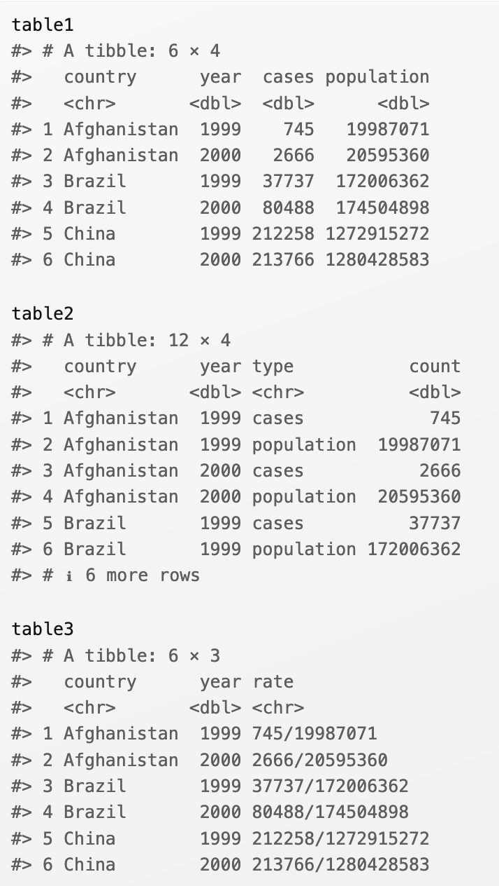
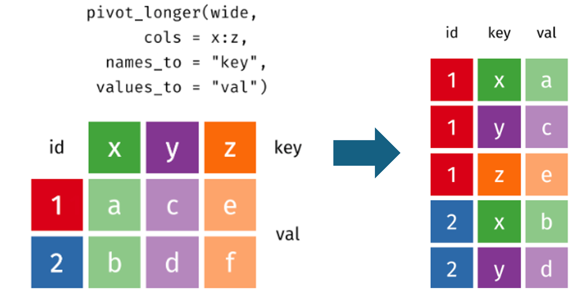
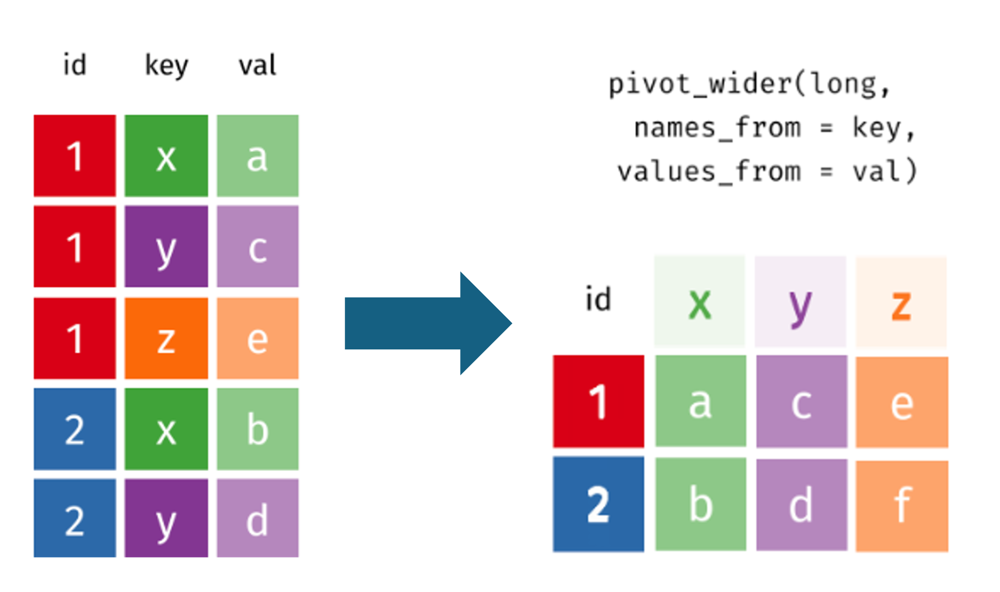

```{r setup, include=FALSE}
knitr::opts_chunk$set(echo = FALSE, message = FALSE, warning = FALSE)
```

```{r, echo=FALSE}
# then load all the relevant packages
pacman::p_load(pacman, knitr, tidyverse, readxl)
```

```{r xaringanExtra-clipboard, echo=FALSE}
# these allow any code snippets to be copied to the clipboard so they 
# can be pasted easily
htmltools::tagList(
    xaringanExtra::use_clipboard(
        button_text = "<i class=\"fa fa-clipboard\"></i>",
        success_text = "<i class=\"fa fa-check\" style=\"color: #90BE6D\"></i>",
    ),
    rmarkdown::html_dependency_font_awesome()
)
```

```{r xaringan-panelset, echo=FALSE}
xaringanExtra::use_panelset()
```


# Purpose and Agenda

This week, we'll dive into an element of data analysis that is surprisingly commonly-needed and useful: pivoting. Pivoting describes transforming data from a form in which variables are represented in rows to one in which they are represented in columns. Sometimes, these different forms are described as "long" and "wide."

## What we'll do in this presentation

- Announcements based on mid-semester survey
- Reading recap & Discussion
- Key Concept: tidy data
- Key Concept: Pivoting
- Code-along and data
- Discussion
- What's next: Assignment(s) and Readings

---

# Announcements based on mid-semester survey

* We'll shorten the discussion time.
* Starting next week, readings are *optional*.
* Starting next week, I'll include assignment review at the beginning of class.

---

# Reading recap & Discussion

.panelset[

.panel[.panel-name[Readings]

Substantive reading(s):

> Kimmons, R., & Veletsianos, G. (2018). Public internet data mining methods in instructional design, educational technology, and online learning research. TechTrends, 62(5), 492-500.


Technical Reading(s):

> Data Tyding: https://r4ds.hadley.nz/data-tidy

]

.panel[.panel-name[Background]

- Our reading highlights both opportunities and significant challenges in public internet data mining. 
- Then you have described a specific context from your own work or research where these challenges may arise.

]

.panel[.panel-name[Discussion Question]

- Please share with your peers what challenges you encounter when cleaning, organizing, and tidying data for analysis, as well as how you plan to address them.

]

.panel[.panel-name[Reading Recap]

> Often the datasets are small enough to address each anomaly individually. One must determine the “why” behind each anomaly or outlier to determine the best means for dealing with that issue. -- Andy

> I would carefully go through the data to remove irrelevant or duplicate entries, use consistent rules to sort and categorize the content (like tagging reviews as positive, negative, or neutral), and exclude anything that looks suspicious or misleading. -- Kamrul

> Fostering collaborations between practitioners and trained researchers can bridge the gap between data access and data literacy, ensuring that insights derived from public and institutional data sources lead to meaningful and effective decision-making. -- Jerri

]

]

---

# Key Concept: tidy data

.panelset[

.panel[.panel-name[Introduction]

> “Happy families are all alike; every unhappy family is unhappy in its own way.” — Leo Tolstoy

> “Tidy datasets are all alike, but every messy dataset is messy in its own way.” — Hadley Wickham

]

.panel[.panel-name[What is tidy data?]

- *Tidy data* refers to a particular expression of the conventions about how data should be recorded, or stored
- The idea was first shared in a *Journal of Statistical Software* paper
- Broadly, "The principles of tidy data provide a standard way to organise data values within a dataset" (Wickham, 2014, p. 1)
- The idea of tidy data relates to other notions how how data should be recorded, including schema for relational databases
]
]

---

# Key Concept: tidy data

.panelset[

.panel[.panel-name[Definition]

**Definition**:

1. Each variable is a column; each column is a variable.
2. Each observation is a row; each row is an observation.
3. Each value is a cell; each cell is a single value.

```{r}
#| echo: false
#| out.width: 80%
#| fig-align: center
knitr::include_graphics("tidy-1.png")
```

]

.panel[.panel-name[Benefits]

**Benefits**:

- There’s a general advantage to picking one consistent way of storing data. If you have a consistent data structure, it’s easier to learn the tools that work with it because they have an underlying uniformity.
- Using the "tidy data" gives you a sense of direction for how you can prepare disorganized data.
- The "tidy data" format works well with many tidyverse functions, including the `group_by()` and `summarize()` we used last week, as well as ggplot2 functions.

]

.panel[.panel-name[Example]

```{r}
#| echo: false
#| out.width: 60%
#| fig-align: center
knitr::include_graphics("original-dfs-tidy.png")
```

]
]

---

# Key Concept: tidy data

.panelset[

.panel[.panel-name[Example]

```{r}
#| echo: false
#| out.width: 50%
#| fig-align: center

```

]

.panel[.panel-name[Example]

**What would this look like tidy?**

```{r, echo = FALSE, eval = TRUE}
tibble(name = c("Maryrose", "Isabella"),
       observation_at_t1 = c(3, 2),
       observation_at_t2 = c(5, 1),
       observation_at_t3 = c(3, 5))
```

]

.panel[.panel-name[Example]

**Each observation must become a row, with a variable indicating when the observation was made.**

```{r, echo = FALSE, eval = TRUE}
tibble(name = rep(c("Maryrose", "Isabella"), 3),
       time = c("observation_at_t1","observation_at_t1","observation_at_t2","observation_at_t2","observation_at_t3","observation_at_t3"),
       observation = c(3, 2, 5, 1, 3, 5))
```

*For examples of other common problems with datasets, check out [the tutorial reading](https://vita.had.co.nz/papers/tidy-data.pdf)(https://vita.had.co.nz/papers/tidy-data.pdf) on tidy data.*
]

]

---

# Key Concept: Pivoting

.panelset[

.panel[.panel-name[How to tidy]

- In the section on the last key concept, we showed a dataset in a tidy form (and its original form)
- We manually changed the format of that dataset, because it was very small in size
- But, how can we tidy data when we're working with larger datasets---when manual transformations are not possible?
    * Moving between long and wide representations is known as *pivoting*.
    * tidyr provides two functions for pivoting data: `pivot_longer()` and `pivot_wider()`.
    
There are aspects of tidy data that cannot be addressed through the `pivot_*()` functions, though we focus on them because the problem they address is very common and otherwise difficult to resolve.

]

.panel[.panel-name[`pivot_longer()`]

- When should `pivot_longer()` be used?
- For the following data frame, this function can be used to tidy the data (I'll show how to use this function in just a moment!)

```{r, echo = FALSE, eval = TRUE}
tibble(name = c("Maryrose", "Isabella"),
       observation_at_t1 = c(3, 2),
       observation_at_t2 = c(5, 1),
       observation_at_t3 = c(3, 5))
```

```{r, echo = FALSE, eval = TRUE}
tibble(name = rep(c("Maryrose", "Isabella"), 3),
       time = c("observation_at_t1","observation_at_t1","observation_at_t2","observation_at_t2","observation_at_t3","observation_at_t3"),
       observation = c(3, 2, 5, 1, 3, 5))
```

]

.panel[.panel-name[`pivot_wider()`]

- When should `pivot_wider()` be used?
- For the following data frame, this function can be used to change the data back to its original form

```{r, echo = FALSE, eval = TRUE}
tibble(name = rep(c("Maryrose", "Isabella"), 3),
       time = c("observation_at_t1","observation_at_t1","observation_at_t2","observation_at_t2","observation_at_t3","observation_at_t3"),
       observation = c(3, 2, 5, 1, 3, 5))
```

```{r, echo = FALSE, eval = TRUE}
tibble(name = c("Maryrose", "Isabella"),
       observation_at_t1 = c(3, 2),
       observation_at_t2 = c(5, 1),
       observation_at_t3 = c(3, 5))
```

]

.panel[.panel-name[Notes]

- You may be wondering, why would we _ever_ want to use `pivot_wider()`, if doing so typically changes data (back) into non-tidy form?
- Sometimes, non-tidy data is useful:
    - For displays of (tables with) data, for which non-tidy data is more familiar or intuitive
    - For certain functions or data analytic techniques that require the data to be in this form
]
]

---

# Key Concept: Pivoting

.panelset[

.panel[.panel-name[Visualizing pivoting]

```{r}
#| echo: false
#| out.width: 60%
#| fig-align: center
knitr::include_graphics("tidyr-pivoting.gif")
```

]

.panel[.panel-name[`pivot_longer()` usage]

```r
pivot_longer(
  data,
  cols,
  names_to = "name",
  values_to = "value",
)
```
```{r, echo = FALSE, out.width="60%", fig.align='left'}

```

]

.panel[.panel-name[`pivot_wider()` usage]

```r
pivot_wider(
  data,
  names_from = name,
  values_from = value
)
```
```{r, echo = FALSE, out.width="60%", fig.align='left'}

```

]

]

---

# Code-along

.panelset[

.panel[.panel-name[pivot_longer()]

- Let's start by tidying the example data frame
- You can click the copy symbol in the top-right of the below code chunk to easily copy this code
- `pivot_longer()` requires that you specify the `names_to` and `values_to` and we use `!` to indicate which columns should _not_ be pivoted

```{r, echo = TRUE, eval = FALSE}
dat <- tibble(name = c("Maryrose", "Isabella"),
              observation_at_t1 = c(3, 2),
              observation_at_t2 = c(5, 1),
              observation_at_t3 = c(3, 5))
dat

dat %>% 
    pivot_longer(!name, names_to = "time", values_to = "values")
```

]

.panel[.panel-name[pivot_wider()]

- Let's start with our data in long form

```{r, echo = TRUE, eval = FALSE}
dat_long <- dat %>% 
    pivot_longer(!name, names_to = "time", values_to = "values")
```

- How might we change this _back_ into wide form?
- `pivot_wider()` requires you to specify `names_from` and `values_from`

```{r, echo = TRUE, eval = FALSE}
dat_long %>% 
    pivot_wider(names_from = "time", values_from = "values")
```
]

.panel[.panel-name[pivot_longer()]

- Let's tidy the second example data frame

```{r, echo = TRUE, eval = FALSE}
dat2 <- tibble(
  person = c("John", "Sarah", "Tom"),
  math_score = c(80, 95, 88),
  science_score = c(90, 85, 92),
  history_score = c(75, 90, 85)
)
dat2
dat2_long <- dat2 %>%
  pivot_longer(
    cols = !person,    # Pivot the score columns
    names_to = "subject",           # New column to store subject names
    values_to = "score"             # New column to store the scores
  )
dat2_long
```

]

.panel[.panel-name[pivot_wider()]

- How might we change this _back_ into wide form?
- `pivot_wider()` requires you to specify `names_from` and `values_from`

```{r, echo = TRUE, eval = FALSE}
dat2_wide_again <- dat2_long %>%
  pivot_wider(
    names_from = subject,      # New columns will be created based on the 'subject' column
    values_from = score        # The 'score' column will fill in the values
  )

dat2_wide_again
```
]

.panel[.panel-name[More practice]

- Let's try tidying a different data frame, transforming it from _wide_ to _long_ form 
- How might we do this? Consider a) which variable(s) should not be pivoted and what the b) `names_to` and c) `values_to` should be

```{r, echo = TRUE, eval = FALSE}
relig_income
```

]
]

---

# What's next?

.panelset[

.panel[.panel-name[Weekly Assignment]

- In this week's assignment, you will tidy a data set while also practicing selecting and renaming variables and joining a second data set

]

.panel[.panel-name[Assignment Data]

- The data we'll use comes from the [*National Teacher and Principal Survey*](https://nces.ed.gov/surveys/ntps/) and is on the number of full-time nurses in schools in U.S. states.

]

.panel[.panel-name[Final Project Planning]

- There is an additional assignment this week: Final Project Planning
- In this assignment, you will read a bit about the final project, and share some _initial, preliminary ideas_ (not final plans!) to receive early feedback (and to get your gears turning regarding what you will do): Instructions in Canvas (https://utk.instructure.com/courses/224781/discussion_topics/1625280)
- Since this is due in the next week (+ based on the mid-semester survey), the readings are optional; be sure to budget time to start to think about your final project

]

.panel[.panel-name[Mini-Project]

- The mini-project is now available in Canvas! You will be using recent data from the Tennessee Department of Education. While the data is specified, the analyses you conduct to answer two questions of the data are more open-ended in nature. You'll have __two weeks (Due 11:59 pm on Monday 4/7/2025)__ to complete this, to allow for time for you to ask questions and dig deep into the data. One pointer - note that many of the variables are at the school-level and represent the percentage of teachers who chose a particular response. How you choose to "wrangle" or prepare the data given the nature of these variables is an important consideration as you work on your mini project. Our goal with this assignment is not perfection, but rather for you to practice capabilities you have developed over the semester. This is reflected in the grading rubric for the assignment!

]

.panel[.panel-name[Optional Substantive Reading(s)]

Substantive reading(s):

> Mann, B., & Saultz, A. (2019). The role of place, geography, and geographic information systems in educational research. Aera Open, 5(3), 2332858419869340.

This is linked in Canvas.

]

.panel[.panel-name[Optional Technical Reading(s)]

- Technical reading(s):

> 5 Census geographic data and applications in R

This is also linked in Canvas.

]
]