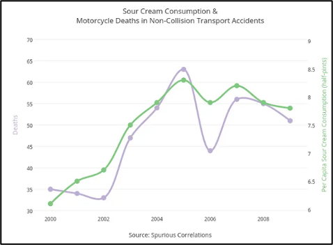
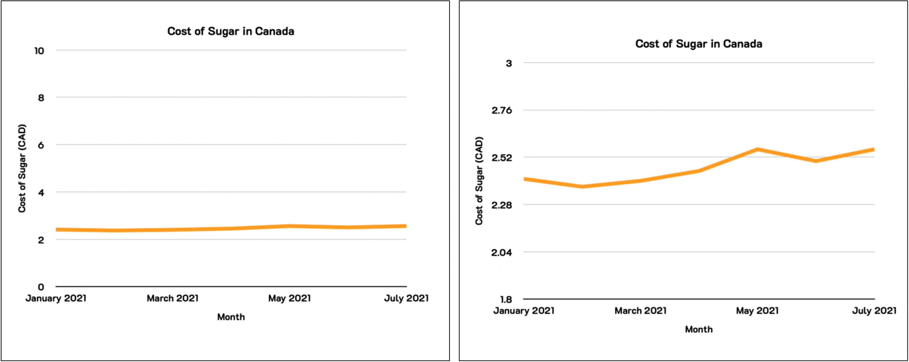
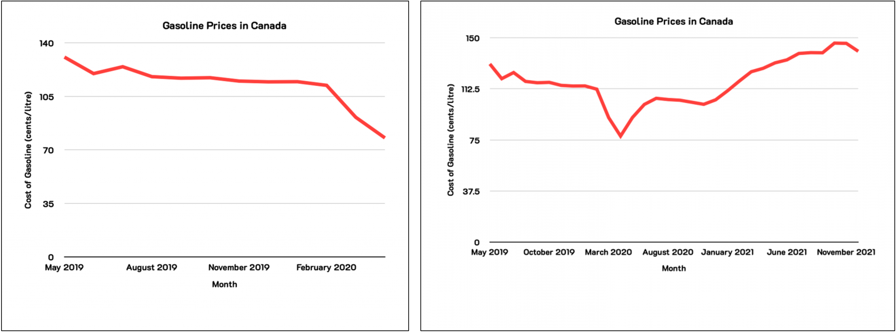
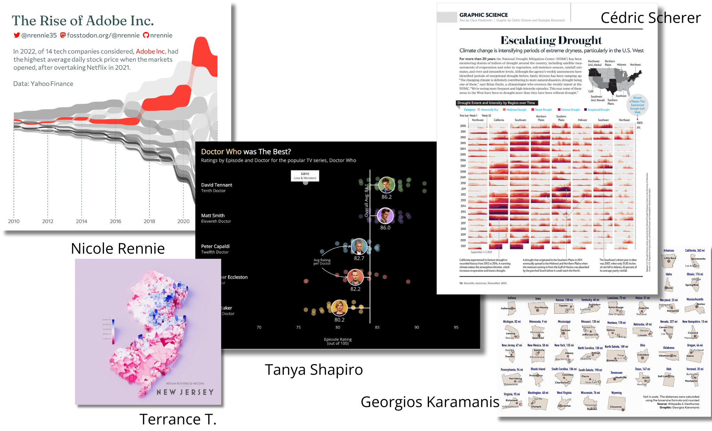

```{r xaringan-themer, include=FALSE, warning=FALSE}
library(xaringanthemer)

style_duo_accent(
    primary_color = "#FF8200",
    secondary_color = "#58595B",
    title_slide_text_color = "#222943",
    title_slide_background_color = "#ededed",
    title_slide_background_image = "https://brand.utk.edu/wp-content/uploads/2019/02/University-HorizRightLogo-RGB.png",
    title_slide_background_position = "bottom",
    title_slide_background_size = "30%"
)
```

```{r setup, include=FALSE}
knitr::opts_chunk$set(echo = FALSE, message = FALSE, warning = FALSE)
```

```{r, echo=FALSE}
# then load all the relevant packages
pacman::p_load(pacman, knitr, tidyverse, readxl)
```

```{r xaringanExtra-clipboard, echo=FALSE}
# these allow any code snippets to be copied to the clipboard so they 
# can be pasted easily
htmltools::tagList(
    xaringanExtra::use_clipboard(
        button_text = "<i class=\"fa fa-clipboard\"></i>",
        success_text = "<i class=\"fa fa-check\" style=\"color: #90BE6D\"></i>",
    ),
    rmarkdown::html_dependency_font_awesome()
)
```

```{r xaringan-panelset, echo=FALSE}
xaringanExtra::use_panelset()
```

# Purpose and Agenda

This week, we answer the following question: What's all the fuss about data science? We will dive into data visualization as a way to make data easy to understand and use.

## What we'll do in this presentation

- Recap
- Discussion from the assignments
- Reading Recap
- Key Concept: ggplot2 and advanced graphics
- Key Concept: Revisiting the Core Skills Framework
- Code-along and data
- What's next: Assignment(s) and Readings

---

# Recap

.pull-left[
**Recap from last asynch class**

In Week 2, we covered:

- Data Science Venn Diagram
- An intro to R, RStudio, the tidyverse, and tidy data
- R's data structures
- Functions, packages, and projects
]

.pull-right[
**Recap from last assignment-only class**

In Week 3, we covered:

- More functions: `filter()`, `select()`, `slice()`, and `pull()`
- Making data visualization that stands out
- Data visualization and equity
- Reproducibility
]

---

# Functions Recap

**tidyverse functions covered:**

- `read_csv()` - Read a CSV file into a tibble
- `glimpse()` - Get a glimpse of your data
- `view()` - View an object
- `filter()` - Keep rows that match a condition
- `select()` - Keep or drop columns using their names and types
- `slice()` - Subset rows using their positions
- `pull()` - Extract a single column

**Other functions covered:**

- `janitor::clean_names()` - Clean the names of an object
- `skimr::skim()` - Skim a data frame, getting useful summary statistics

---

# Discussion from the assignments

Question: Can we talk about the logic of the programming language?

- The tidyverse focuses on data manipulation
- We apply functions like they are 'verbs', where each verb does something

.pull-left[
```r
data %>% 
    dplyr_verb(stuff-to-do)
```
]

.pull-right[
```r
dplyr_verb(data, stuff-to-do)
```
]

```r
# in this case, the stuff-to-do is a logical test
mtcars %>% 
    filter(mpg > 30) 
    
filter(mtcars, mpg > 30)     
```

```r
# in this case, the stuff-to-do is specifying the column to keep
mtcars %>% 
    select(mpg)
```

---

# Discussion from the assignments

Question: Can we use multiple functions together?

Answer: **Yes!** With the pipe `%>%` (or `|>`), we can send the output of one operation into another. This saves time and space and can make our code easier to read.

```r
mtcars %>%
    filter(mpg > 30) %>% 
    select(mpg)
```

---

# Discussion from the assignments

Question: How do I know what the `stuff-to-do` should be?

Answer: The documentation!

- Describe what you want to achieve to find any posts on stack overflow or get assistance from GenAI
- Google search your verb, such as "dplyr select"
- In RStudio, search `??dplyr::select` in the console

**How else have others found the right syntax for their code?**

---

# Reading Recap - Week 3

Substantive reading(s):

> McCandless, D. (2010). The beauty of data visualization.

> Schwabish, J., Feng, A. Do No Harm Guide: Applying Equity Awareness in Data Visualization (summary only)

> Spreadsheet error led to Edinburgh hospital opening delay

---

# Reading Recap - Week 3

Let me briefly reflect on your Week 3 reading discussions:

> - Clarity, intentional design, and storytelling in visualization 

> - Prompt 3: appreciated your personal stories! --> building bridges between the learning concepts and your own experiences

> - Good workflows (reproducibility) aren’t just about efficiency; they shape the quality and impact of the work we do

> - I carefully read your responses to all discussion prompts, so please keep up the great work!

---

# Discussion

.panelset[

.panel[.panel-name[Background]

Data visualizations can be used as an effective means of communication across a variety of audiences.

This includes not only those who interpret your visualizations, but also you and your collaborators as you strive to gain a deeper understanding of your data.

]

.panel[.panel-name[Reflection Questions]

- What process should we go through to visualize our data? What steps might we take, and what considerations should we keep in mind before we even start making a chart?

- What kinds of design choices (or common mistakes!) can create misleading data visualizations? Have you ever encountered a chart or graphic that felt confusing, unclear, or even a little deceptive? What specifically made it feel that way to you?

]

.panel[.panel-name[Example 1]

- Misleading example 1: False causation

]

.panel[.panel-name[Example 2]

- Misleading example 2: Inconsistent or Manipulated Scale

]

.panel[.panel-name[Example 3]

- Misleading example 3: Cherry-picking or Omitting Data


]

.panel[.panel-name[Discussion questions]

Examples of good data visualizations: https://www.tableau.com/learn/articles/best-beautiful-data-visualization-examples#crimean-war

1. Choose your favorite, and explain why.

2. What are some common challenges or limitations you've identified while visualizing data using Microsoft Excel or Google Sheets?

Please share your ideas briefly here: [Week 3 - Discussion](https://utk.instructure.com/courses/253707/discussion_topics/1955789)

]
]

???

This discussion can serve as an opening to discussing what ggplot2's strengths are relative to the above two tools.

---

# Key Concept: Revisiting the Core

*Let's quickly revisit the core skills we discussed last time*

.panelset[

.panel[.panel-name[Data]
**Data** in R

We have focused on these two data structures, though others you will encounter later on include vectors, matrices, and lists:

- **Data Frames**: Tabular data, can mix different types
- **Tibbles**: Modern version of data frames (from the tidyverse)

]

.panel[.panel-name[Packages]
**Packages** in R
Packages are collections of functions and datasets that extend R:

- You have used tidyverse, skimr, and janitor so far
- This week, we're focusing on ggplot2
- We'll use many others throughout the semester
- You might start exploring packages related to interests you have now! There are tens of thousands to do nearly anything with data

]

.panel[.panel-name[Functions]
**Functions** in R
Functions are made up of code that perform specific tasks:
- Can be built-in (e.g., `mean()`, `sum()`) or loaded from a package (e.g., `glimpse()`)
- You can write your own function! We'll discuss this at another point in this class

]

.panel[.panel-name[Projects and File Paths]
**Projects and File Paths** in RStudio
Projects help organize your work:
- Keep related scripts, data, and outputs together
- We *always* work in projects in this class

]

]

*Again, these core skills will be the basis of all of our analyses in R.*

---

# Key Concept: ggplot2

.panelset[

.panel[.panel-name[ggplot2]
**ggplot2**: 
- An R package for data visualization
- Based on the *Grammar of Graphics*
- Created by Hadley Wickham
- Part of the `tidyverse`, a suite of R packages for data science

]

.panel[.panel-name[the grammar of graphics]
**The Grammar of Graphics**:
- A systematic way to describe and build graphs
- Focuses on layers of visualizations
- Elements include:
  - **Data**: What you want to plot
  - **Aesthetics**: How data is mapped to visuals
  - **Geoms**: Geometric objects like points, lines, bars
  - **Stats**: Statistical transformations, e.g., smoothing
  - **Facets**: Ways to split data into subsets for multiple plots

]

.panel[.panel-name[Example ggplot2 code]
**Example ggplot2 code**:

```{r, eval = FALSE, echo = TRUE}
library(tidyverse) # note, this loads the ggplot2 package

ggplot(data = mtcars, aes(x = mpg, y = wt)) +
    geom_point(aes(color = cyl)) +
    labs(
        title = "MPG vs. Weight",
        x = "Miles per Gallon",
        y = "Weight (in 1000s of lbs)",
        color = "Number of Cylinders"
    )
```

]
]

---

# Key Concept: ggplot2



---

# Code-along

.panelset[

.panel[.panel-name[ggplot()]

- we use `ggplot()` to start our plotting of the built-in `penguins` dataset from the palmerpenguins package

```{r, eval = FALSE, echo = TRUE}
library(tidyverse) # let's load the tidyverse, loading ggplot2 & other packages

install.packages("palmerpenguins") # make sure to install with install.packages() first
library(palmerpenguins)

ggplot(penguins)
```

or 

```{r, eval = FALSE, echo = TRUE}
penguins %>% 
    ggplot()
```

*This won't do... much (yet!)*

]

.panel[.panel-name[aes()]

- add on to our initial code by specifying the _aesthetic mapping_ with `aes()`
- specifically, let's tell R what the *x* variable is - let's pick _any_ numeric variable from the data set

```{r, eval = FALSE, echo = TRUE}
glimpse(penguins) # to see which variables are numeric
view(penguins) # to see the actual dataset
ggplot(penguins, aes(x = body_mass_g)) # can change to another!
```

**Still not doing much!**

]

.panel[.panel-name[geom_*]

- Last, specify the geometric object you want to use to represent the variable you mapped to an aesthetic
- Let's try a histogram!
- We always add *layers* onto ggplot2 plots with the `+` operator

```{r, eval = FALSE, echo = TRUE}
ggplot(penguins, aes(x = body_mass_g)) + 
  geom_histogram()
```

*Voilà!*

]

.panel[.panel-name[geom_*]

- Let's expand on what we've done by examining _two_ variables, one we "map" to *x*, another to *y*
- We'll see how the bill length and depth of penguins relate, using a different geom to do so with a scatterplot

```{r, eval = FALSE, echo = TRUE}
ggplot(penguins, aes(x = bill_length_mm, 
                     y = bill_depth_mm)) +
  geom_point()
```

*Voilà (take two)!*

]

.panel[.panel-name[a 3rd variable]

- Part of the joy of ggplot2 is the flexibility you have in how you can modify a plot
- What if we want to visualize a third variable? 
    - We have several aesthetic features we can "map" this third variable to, including the size, shape, and color of points

```{r, eval = FALSE, echo = TRUE}
ggplot(penguins,
       aes(x = bill_length_mm,
           y = bill_depth_mm,
           color = species)) +
  geom_point()
```

*Voilà (take three)!*

]

.panel[.panel-name[More additions]

- The sky is the limit! 
- We can also add other geoms to our plot, like one representing the _slope_ of the relation between *x* and *y*
- Furthermore, we can easily _theme_ out plot

```{r, eval = FALSE, echo = TRUE}
ggplot(penguins,
       aes(x = bill_length_mm,
           y = bill_depth_mm,
           color = species)) +
    geom_point() +
    geom_smooth(method = "lm") +
    theme_bw()
```

]

]

---

# What's next?

.panelset[


.panel[.panel-name[Weekly Assignment]

- We'll be doing more with ggplot2 in this lab, while returning back to some of the functions we used last week
- We'll be faceting our plots using a _layer_ we can add, `facet_wrap()`

```{r, eval = FALSE, echo = TRUE}
ggplot(penguins,
       aes(x = bill_length_mm,
           y = bill_depth_mm,
           color = species)) +
  geom_point() +
  geom_smooth(method = "lm") + 
  theme_bw() +
  facet_wrap(penguins$species) # When you put $ after your data frame, it displays the names of its columns (press tab to see the list of columns).
```

]

.panel[.panel-name[Data]

- We'll be using a large, complex dataset from the United States Department of Education
- Specifically, we'll use data from the [Elementary/Secondary Information System (ElSi)](https://nces.ed.gov/ccd/elsi/), a data collection system that includes information on the more than 100,000 schools and more than 8,000 school districts in the country
- Note: Even though this data is large and complex, it is _not_ cleaned, and one slightly unusual thing we'll need to do is _skip_ the first six rows of the CSV file accessed through the ElSi, because they're blank!

]

.panel[.panel-name[Substantive Reading(s)]

- Substantive reading(s) for the week ahead (Optional):

> Worsley, M., Martinez -Maldonado, R., & D'Angelo, C. (2021). A New Era in Multimodal Learning Analytics: Twelve Core Commitments to Ground and Grow MMLA. Journal of Learning

Linked in Canvas.

]

.panel[.panel-name[Technical Reading(s)]

- Technical reading(s) for the week ahead (Required):

> R 4 Data Science, Chapter 20, Joining tables

> Joining tables tutorial

Also linked in Canvas.

]

]
