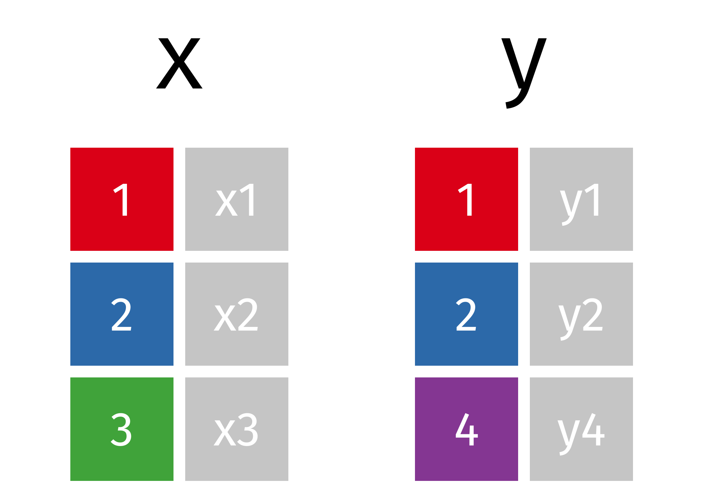
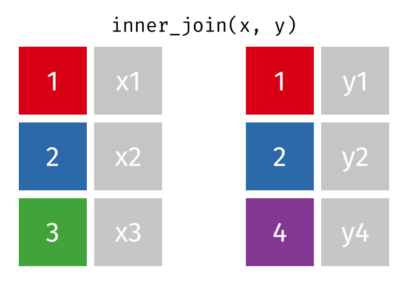
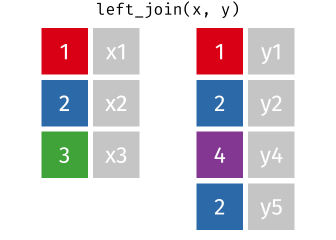

```{r xaringan-themer, include=FALSE, warning=FALSE}
library(xaringanthemer)

style_duo_accent(
    primary_color = "#FF8200",
    secondary_color = "#58595B",
    title_slide_text_color = "#222943",
    title_slide_background_color = "#ededed",
    title_slide_background_image = "https://brand.utk.edu/wp-content/uploads/2019/02/University-HorizRightLogo-RGB.png",
    title_slide_background_position = "bottom",
    title_slide_background_size = "30%"
)
```

```{r setup, include=FALSE}
knitr::opts_chunk$set(echo = FALSE, message = FALSE, warning = FALSE)
```

```{r, echo=FALSE}
# then load all the relevant packages
pacman::p_load(pacman, knitr, tidyverse, readxl)
```

```{r xaringanExtra-clipboard, echo=FALSE}
# these allow any code snippets to be copied to the clipboard so they 
# can be pasted easily
htmltools::tagList(
    xaringanExtra::use_clipboard(button_text = "<i class=\"fa fa-clipboard\"></i>",
                                 success_text = "<i class=\"fa fa-check\" style=\"color: #90BE6D\"></i>",),
    rmarkdown::html_dependency_font_awesome()
)
```

```{r xaringan-panelset, echo=FALSE}
xaringanExtra::use_panelset()
```

```{r}
#| include: false

x <- tibble::tribble(
    ~key,   ~x,
      1L, "x1",
      2L, "x2",
      3L, "x3"
    )

y <- tibble::tribble(
         ~key,   ~y,
           1L, "y1",
           2L, "y2",
           4L, "y4"
         )

y_extra <- tibble::tribble(
         ~key,   ~y,
           1L, "y1",
           2L, "y2",
           4L, "y4",
           2L, "y5"
         )
```

# Purpose and Agenda

What's so useful about coding? That question is the focus of this class. We'll focus on _joining_ two data sets in R. We'll use the NAEP data, joining data on spending on kids to understand whether there are any clear relationships between spending and academic achievement.

## What we'll do in this presentation

- Key Concept: More ggplot2 fun(ctions)
- Reading Recap
- Discussion
- Break
- Key Concept: Joining
- Code-along
- What's next: Assignment(s) and Readings

---

# Key Concept: More exploratory data analysis (EDA) with ggplot2

.panelset[

.panel[.panel-name[geom_point()]
**A quick refresher on geom_point()**: 
- Used for creating scatterplots.
- Great for visualizing relationships between two numeric variables.

```{r, eval=FALSE, echo = TRUE}
ggplot(data = mtcars, aes(x = mpg, y = wt)) +
    geom_point() # consider swapping out with geom_jitter(); what does this do?
```

]

.panel[.panel-name[points colors]
**Changing Points Colors**:
- Colors can provide additional information about data points.
- Use the `color` aesthetic in `aes()` to assign colors based on a variable.

```{r, eval=FALSE, echo = TRUE}
ggplot(data = mtcars, aes(x = mpg, y = wt, color = cyl)) +
    geom_point()

# Continuous color scales: scale_color_gradient()
ggplot(data = mtcars, aes(x = mpg, y = wt, color = cyl)) +
    geom_point() +
    scale_color_gradient(low = "#88CCEE", high = "#D95F02")  # You can directly assign custom colors using hexadecimal, RGB, or named colors

# Categorical color scales: scale_color_brewer()
```
]

.panel[.panel-name[geom_smooth()]
**geom_smooth()**: 
- Adds a smoothed line to the plot.
- Useful for spotting trends or patterns in scatterplots.
- Can also add a straight regression line with `method = "lm"`.

```{r, eval=FALSE, echo = TRUE}
ggplot(data = mtcars, aes(x = mpg, y = wt)) +
    geom_point() +
    geom_smooth(method = "lm", se = FALSE)
```

]

.panel[.panel-name[themes]
**Themes in ggplot2**:
- Themes control the appearance of the plot.
- They dictate elements like background color, gridlines, and font sizes.
- `ggplot2` has several built-in themes, e.g., `theme_minimal()`, `theme_dark()`, and `theme_bw()`
- other packages (e.g., [ggthemes](https://yutannihilation.github.io/allYourFigureAreBelongToUs/ggthemes/)) add _many_ more themes

```{r, eval=FALSE, echo = TRUE}
ggplot(data = mtcars, aes(x = mpg, y = wt)) +
    geom_point() +
    theme_minimal()
```
]

.panel[.panel-name[labels]
**Adding Labels**:
- Provide context and clarity to your plots.
- Functions like `labs()`, `xlab()`, `ylab()`, and `labs(title = )` allow for adding or modifying labels.

```{r, eval=FALSE, echo = TRUE}
ggplot(data = mtcars, aes(x = mpg, y = wt)) +
    geom_point() +
    labs(title = "MPG vs. Weight",
         x = "Miles per Gallon",
         y = "Weight (1000s lbs)")
```

]

]

---

# Key Concept: More ggplot2 fun(ctions)

* `alpha` for transparency of geoms when there is overplotting
* `scale_color_colorblind()` for colorblind accessibility
* `ggsave()` for exporting plots
* Reading error messages for information

Example:
```{r, eval=FALSE, echo = TRUE}
plot <- ggplot(mtcars, aes(x = mpg, y = wt, color = factor(gear))) +
  geom_point(alpha = 0.6) +             # Makes points 60% opaque
  scale_color_colorblind() +            # Use colorblind-friendly palette for categorical data
  theme_minimal() +                     # Use minimal theme for a clean look
  labs(title = "MPG vs Weight by Number of Gears",  
       x = "Miles per Gallon (MPG)",               
       y = "Weight (1000 lbs)",                    
       color = "Number of Gears")     

# Save the plot
ggsave("mtcars_plot_gear.png", plot = plot)
```
---

# Reading Recap

<small>
>  I felt that this commitment (data privacy and ethics) distinguished MMLA from traditional LA because they acknowledged the risks with multimodal data as it applies to students/teachers in a learning environment. -- Haylee

> While Lang et al. acknowledge the importance of integrating contextual and ethical considerations into LA, MMLA takes this further by actively de-emphasizing screen-based interactions and embracing richer, more immersive learning environments. -- Jerri

>  They also mention the importance of recognizing the difference between ecological and laboratory settings (another distinction made between the two types of LAs) and I do agree that having access to a variety of means of collecting data does not mean that it should be dispersed everywhere when it does not align with the "learning goals and research questions being explored" -- Zaharia

> You must pay close attention to variable names that are common across data sets but have different meanings in each table. This could cause confusion or possible errors in the merger if the data name is misconstrued as a key that can be used to merge the data. -- Andy

> Before performing the join, it is necessary to handle duplicates and missing values in these key columns and prepare the data properly. After that, choosing the right type of join based on your goal is also crucial. -- Kubra

</small>

???

Share some notes from the discussion here

---

# Discussion

.panelset[

.panel[.panel-name[Background]

- Often, the data we want to analyze are in multiple files (e.g., CSV, or Excel files) or databases (e.g., a SQL database)
- The _key_ to combining data is to ensure that the data we are joining share a common . . . _key_!

.pull-left[
```{r, echo = TRUE}
x
```

]

.pull-right[

```{r, echo = TRUE}
y
```

]

]

.panel[.panel-name[Discussion Question]

- [Breakout room discussion in pairs] What are some use cases for your research (past or planned) that involve multiple data files? And, why might it be important to join those files together?

- [Whole group discussion 1] How do you think the integration of diverse data sources can improve the educational experience for students?
- [Whole group discussion 2] What challenges or issues do you anticipate when combining data from various sources for fields such as learning analytics?

]

]

---

# Key Concept: Joins

.panelset[

.panel[.panel-name[two data frames]
**Working with Two Data Frames**: 
- **Data frames**: Tabular structures in R with rows and columns.
- Can be thought of as results from loading two distinct files into R.
- The join functions in `dplyr` work with two data frames.

.pull-left[
```{r, echo = TRUE}
x
```

]

.pull-right[

```{r, echo = TRUE}
y
```

]
]

.panel[.panel-name[visualizing two data frames]

```{r}
#| out.width: 60%
#| fig-align: center

```


Source: https://www.garrickadenbuie.com/project/tidyexplain/

]
]

---

# Types of dplyr joins: Inner join

.panelset[

.panel[.panel-name[Definition]

> Keep all rows from `x` where there are matching values in `y`, and all columns from `x` and `y`.

```{r}
#| out.width: 60%
#| fig-align: center

```

]

.panel[.panel-name[R syntax]

```{r}
#| echo: true
inner_join(x, y, by = "key")
```

]
]

---

# Types of dplyr joins: Left join

.panelset[

.panel[.panel-name[Definition]

> Keep all rows from `x`, and all columns from `x` and `y`. Rows in `x` with no match in `y` will have `NA` values in the new columns.

```{r}
#| out.width: 60%
#| fig-align: center
knitr::include_graphics("images/left-join.gif")
```

]

.panel[.panel-name[R syntax]

```{r}
#| echo: true
left_join(x, y, by = "key")
```

]

.panel[.panel-name[y_extra]

`y_extra` has multiple rows with the key from `x`

```{r}
#| echo: true
y_extra
```

]

.panel[.panel-name[Extra rows in y]

> ... If there are multiple matches between x and y, all combinations of the matches are returned.

```{r}
#| out.width: 60%
#| fig-align: center

```

]
.panel[.panel-name[R syntax]

```{r}
#| echo: true
left_join(x, y_extra, by = "key")
```

]

]

---

# Types of dplyr joins: Right join

.panelset[

.panel[.panel-name[Definition]

> Keep all rows from `y`, and all columns from `x` and `y`. Rows in `y` with no match in `x` will have `NA` values in the new columns.

```{r}
#| out.width: 60%
#| fig-align: center

```

]

.panel[.panel-name[R syntax]

```{r}
#| echo: true
right_join(x, y, by = "key")
```

]
]

---

# Types of dplyr joins: Full join

.panelset[

.panel[.panel-name[Definition]

> Keep all rows and all columns from both `x` and `y`. Where there are not matching values, returns `NA` for the ones missing.

```{r}
#| out.width: 60%
#| fig-align: center
knitr::include_graphics("images/full-join.gif")
```

]

.panel[.panel-name[R syntax]

```{r}
#| echo: true
full_join(x, y, by = "key")
```

]
]

---

# Types of dplyr joins: Anti join and semi join

There are also two filtering joins that we won't discuss further at this time: `anti_join()` and `semi_join()`.

---

# Important notes

- If the key columns have different names in each data frame, use the syntax `by = join_by(key1 == key2)` within the join function.

```{r}
#| eval: false
#| echo: true
full_join(a, b, by = join_by(key == id))
```

- If joining by multiple columns, provide them as a vector `by = join_by(key1, key2)`.

```{r}
#| eval: false
#| echo: true
full_join(m, n, by = join_by(key, id))
```

- Beware of duplicate rows: Ensure that the key column(s) uniquely identify rows, or you may get unintended repeats.

---

# Code-along

.panelset[

.panel[.panel-name[left_join()]

```{r, eval = FALSE, echo = TRUE}
band_members
band_instruments

band_members %>% 
    left_join(band_instruments, by = "name")
# also try right_join!
```

]

.panel[.panel-name[full_join()]

```{r, eval = FALSE, echo = TRUE}
band_members %>% 
    full_join(band_instruments,  by = "name")
```

]

.panel[.panel-name[different keys]

```{r, eval = FALSE, echo = TRUE}
band_members
band_instruments2

band_members %>% 
    full_join(band_instruments2, by = join_by(name == artist))
```

]

.panel[.panel-name[multiple keys]

```{r, eval = FALSE, echo = TRUE}
band_members
band_instruments
# what if the Paul in instruments is from another band?
band_instruments_new <- 
  band_instruments %>% 
  mutate(band = c("Beatles", "Porcupines", "Stones")) # The mutate() function is used to add or modify columns in a data frame.

band_instruments_new
# we can then join on both name *and* band
band_members %>% 
    left_join(band_instruments_new, by = join_by(name, band))
```

]

]

???

May want to demonstrate some of the new ggplot2 code, too (geom_smooth, maybe?)

---

# What's next?

.panelset[

.panel[.panel-name[Weekly Assignment]

- We'll be joining together two files and conducting an authentic analysis about what relates to student academic achievement
- The analysis will take the form of a scatterplot with a fitted line --- effectively, a visual representation of a simple (one variable) linear regression model

]

.panel[.panel-name[Data]

- We'll be using NAEP data again
- In addition, we'll be using data on state-by-state spending on children; read about the data here: https://jrosen48.github.io/tidykids/articles/tidykids-codebook.html

]

.panel[.panel-name[Substantive Reading(s)]

- Substantive reading(s) for the week ahead:

> Reich, J. (2022). Learning analytics and learning at scale. Lang, C., Siemens, G. Wise, AF, Gašević, D., Merceron, A.,(eds.) Handbook of Learning Analytics, 2nd ed. Vancouver, Canada: SOLAR.

> Rosenberg et al. (2022) Posts about students on Facebook: A data ethics perspective

Linked in Canvas.

]

.panel[.panel-name[Technical Reading(s)]

- Technical reading(s) for the week ahead:

> Education data package

> R for Data Science, Chapter 3

Also linked in Canvas.

]

]