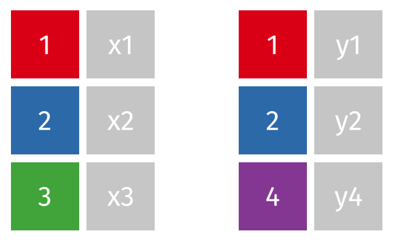
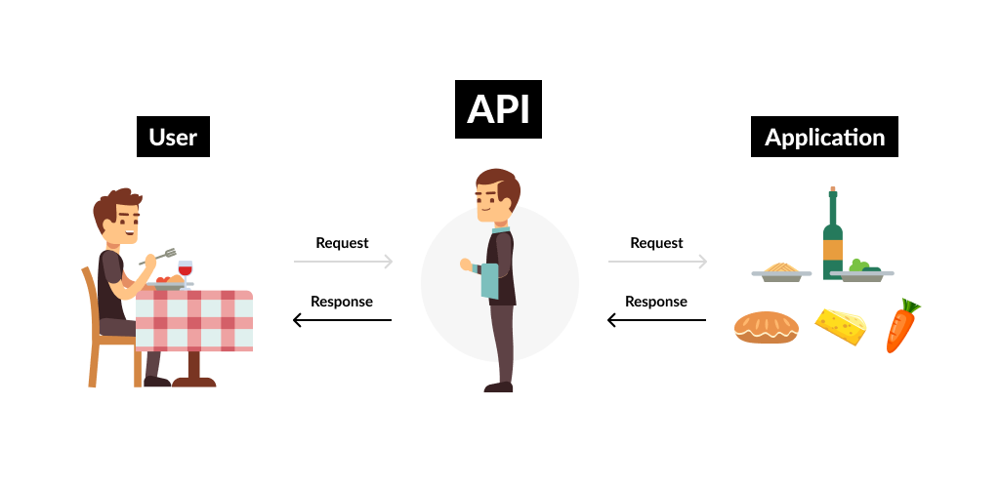
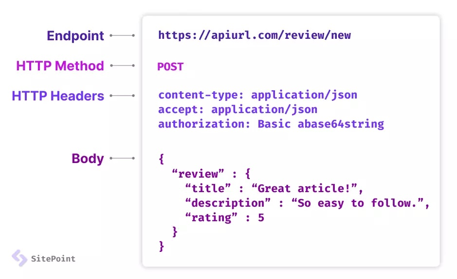

```{r xaringan-themer, include=FALSE, warning=FALSE}
library(xaringanthemer)

style_duo_accent(primary_color = "#FF8200",
                 secondary_color = "#58595B",
                 title_slide_text_color = "#222943",
                 title_slide_background_color = "#ededed",
                 title_slide_background_image = "https://brand.utk.edu/wp-content/uploads/2019/02/University-HorizRightLogo-RGB.png",
                 title_slide_background_position = "bottom",
                 title_slide_background_size = "30%")
```


```{r setup, include=FALSE}
knitr::opts_chunk$set(echo = FALSE, message = FALSE, warning = FALSE)
```

```{r, echo=FALSE}
# then load all the relevant packages
pacman::p_load(pacman, knitr, tidyverse, readxl)
```

```{r xaringanExtra-clipboard, echo=FALSE}
# these allow any code snippets to be copied to the clipboard so they 
# can be pasted easily
htmltools::tagList(
    xaringanExtra::use_clipboard(button_text = "<i class=\"fa fa-clipboard\"></i>",
                                 success_text = "<i class=\"fa fa-check\" style=\"color: #90BE6D\"></i>",),
    rmarkdown::html_dependency_font_awesome()
)
```

```{r xaringan-panelset, echo=FALSE}
xaringanExtra::use_panelset()
```

# Purpose and Agenda

Data scientists often talk about "log trace" or "real-time" data. How do we access such data? This week, we explore ways to do that through Application Programming Interfaces, or **APIs**. We'll use the educationdata package to access the Education Data Portal API created by the Urban Institute.

## What we'll do in this presentation

- Brief Review
- Reading Recap
- Discussion
- Key Concept: Log data and Application Programming Interfaces (APIs)
- Key Concept: The educationdata package
- Code-along and data
- What's next: Assignment(s) and Readings

---

# Quick question!

What type of join is this?

```{r}
#| out.width: 60%
#| fig-align: center

```

---

# Brief Review of Joins

.panelset[

.panel[.panel-name[Inner Join]

```{r}
#| out.width: 60%
#| fig-align: center
knitr::include_graphics("images/inner-join.gif")
```

]


.panel[.panel-name[Left Join]

```{r}
#| out.width: 60%
#| fig-align: center
knitr::include_graphics("images/left-join.gif")
```

]

.panel[.panel-name[Right Join]

```{r}
#| out.width: 60%
#| fig-align: center
knitr::include_graphics("images/right-join.gif")
```

]

.panel[.panel-name[Full Join]

```{r}
#| out.width: 60%
#| fig-align: center
knitr::include_graphics("images/full-join.gif")
```

]

.panel[.panel-name[Things to look out for]

- Data cleaning, format, limitations
- Can they even be joined?
- Type of join
- Primary key
- Visualizing the join
- Analyzing the joined dataset

]

]

---

# Reading Recap

Substantive reading(s) -- Optional:

> Rutherford et al. (2022). Leveraging mathematics software data to understand student learning and motivation
during the COVID-19 pandemic

> Rosenberg et al. (2022). Posts About Students on Facebook: A Data Ethics Perspective

Technical reading(s) -- Required:

> Education data package

> R for Data Science, Chapter 3

Great job everyone!

---

# Accessing data

.panelset[

.panel[.panel-name[Background]

A variety of services on the Internet allow people -- including _researchers_ -- to access data from those services

- There are many services, including:

    - **Social media**: Instagram, Facebook, Pinterest
    - **Work-related**: Canvas, MOOCs (Massive Open Online Courses)
    - **Government**: Integrated Postsecondary Education Data System (IPEDS), National Institute of Mental Health, U.S. census data
    - **Personal**: Garmin, Nest thermostats

]

.panel[.panel-name[Discussion Question]

What is an Internet-based service or organization that provides data that could be of interest to you, either for research or just curiosity? 

- Think broadly and consider doing a bit of research, searching for a service of interest plus the term "API" (Application Programming Interfaces)
- <u><b>Paste your response</b></u> (entity + an example of data they provide + whether they have an API) in here [Week 6 - Lecture Discussion](https://utk.instructure.com/courses/253707/discussion_topics/1966641)

]

]

---

## Key Concept: Log data and APIs

.panelset[

.panel[.panel-name[Log data]

- Different researchers use a variety of terms to refer to *data generated by peoples' interactions with digital services*:
    - "Log file data" or "log data" (see [Wise et al., 2012](https://www.sciencedirect.com/science/article/pii/S1096751611000911) and [Rutherford et al., 2022)](https://www.tandfonline.com/doi/pdf/10.1080/15391523.2021.1920520): interactions with learning management systems and educational games
    - "Trace data" (see [Winneh et al., 2017](https://escholarship.mcgill.ca/concern/articles/v692tb17v)): interactions with a tool intended to support studying
    - "Digital traces" (see [Greenhalgh & Koehler, 2017](https://link.springer.com/article/10.1007/s11528-016-0142-4)): tweets
    
- In this course, we use the term **log data** to refer to this kind of data

]

.panel[.panel-name[APIs]

- Researchers can access log trace in a variety of ways, including by collaborating with individuals working at educational technology organizations or developing a tool that generates data
- For larger companies or sources of data that are of wider interest, Application Programming Interfaces (APIs) are more common
    - **API**: A set of rules, protocols, and tools that allows software applications (and *programming languages*, like R!) to communicate with each other
    
```{r}
#| echo: false
#| out.width: 60%
#| fig-align: center

```

]

.panel[.panel-name[Why use APIs?]

* **Data accessibility**: APIs provide researchers with direct access to a wealth of educational data that may not be readily available through other means
* **Real-time data**: Many educational APIs offer real-time or near-real-time data updates
* **Efficiency**: APIs allow researchers to automate data retrieval and analysis processes
* **Interdisciplinary collaboration**: APIs can facilitate collaboration between researchers from various fields

]

.panel[.panel-name[Web-based APIs]

- We will focus on a particular type of API referred to as **web-based APIs**, though there are others, including APIs to access databases, messages and emails, and user authentication
- Web-based APIs have _rules_, _protocols_, and _tools_ that make it easier to use software and programming languages to access data

```{r}
#| echo: false
#| out.width: 60%
#| fig-align: center

```

]
]

---

# Education Data Portal

.panelset[

.panel[.panel-name[Education Data Portal]

The Education Data Portal (EDP) provides ready access to a range of education-related data sources:

> Every year, the federal government releases large amounts of data on U.S. schools, school districts, and colleges. But this information is scattered across multiple datasets that are often difficult to access, and changes in data structure complicate efforts to measure change over time.

> To make these data more accessible, our website is organized by the institutions to which the information pertains: schools, school districts, and colleges. We’ve harmonized variables and documentation across datasets and time to make it easier to look at trends over time and combine data from different sources.

]

.panel[.panel-name[Example]

Here [(click)](https://educationdata.urban.org/api/v1/schools/ccd/enrollment/2013/grade-3/?charter=1&fips=47) is an example of an API from the Education Data Portal: `https://educationdata.urban.org/api/v1/schools/ccd/enrollment/2013/grade-3/?charter=1&fips=47`

- The URL specifies our request by stating we want to:
    1. **access the API**, specifically **version 1**
    2. **request data on schools**, specifically **from the Common Core of Data** data source
    3. even more specifically, we want **enrollment data** for **2013**
    4. for students in **third grade** in **charter schools** in a particular state, **Tennessee**
- See other examples here[(click)](https://educationdata.urban.org/documentation/schools.html): https://educationdata.urban.org/documentation/schools.html

]


.panel[.panel-name[Discussion question]

Here [(click)](https://educationdata.urban.org/api/v1/schools/ccd/enrollment/2013/grade-3/?charter=1&fips=47) is an example of an API from the Education Data Portal: `https://educationdata.urban.org/api/v1/schools/ccd/enrollment/2013/grade-3/?charter=1&fips=47`

- Can you _manually_ (by typing out the URL) create another request? After you create it, copy and paste the complete URL here</b></u> [Week 6 - Lecture Discussion](https://utk.instructure.com/courses/253707/discussion_topics/1966641)

- What are some potential advantages and disadvantages of accessing data by editing the URL?

]

.panel[.panel-name[Potential issues]

There are several issues with what we've just done:

- *First*, specifying the requests manually (by typing out the URL) is a bit difficult
- *Second*, the data is returned in JSON format, which we can't directly use in R
- *Third*, what if we want to make several - or very many - requests in series? It is hard to do this through the browser
- The educationdata R package addresses each of these issues with accessing data from the Education Data Portal API

]


]

???

it may be worth checking out those other examples

---

# Key Concept: educationdata

.panelset[

.panel[.panel-name[The educationdata R package]

- The [educationdata R package](https://urbaninstitute.github.io/education-data-package-r/index.html) facilitates access to the [Education Data Portal's API](https://educationdata.urban.org/documentation/index.html)
- Example code that replicates what we earlier accessed via URL:

```{r, eval = FALSE, echo = TRUE}
# install.packages("educationdata") # be sure to run this, first

df <- get_education_data(level = 'schools', 
                         source = 'ccd', 
                         topic = 'enrollment', 
                         subtopic = list('race', 'sex'),
                         filters = list(year = 2013,
                                        grade = 3),
                         csv = TRUE) # this makes accessing large data sets faster
```

]

.panel[.panel-name[Advantages]

- The code on the last slide addresses three issues with the URL-based method:

    - We can specify the parameters as arguments for the function --- rather than as different parts of a URL
    - We receive a data frame as output --- rather than JSON
    - We can change the function call to access different data

]

.panel[.panel-name[Documentation]

Two sources of documentation are key for this week and the following weeks:

1. The R package documentation [(click)](https://urbaninstitute.github.io/education-data-package-r/articles/introducing-educationdata.html): https://urbaninstitute.github.io/education-data-package-r/articles/introducing-educationdata.html
2. The EDP API documentation [(click)](https://educationdata.urban.org/documentation/index.html): https://educationdata.urban.org/documentation/index.html

**Review these both, seeing how you can access various data sources from the API, noting that the EDP API documentation provides example R code to access any variable in any of the available data sets**

]
]

---

# Code-along

.panelset[

.panel[.panel-name[Start small]

Let's look at 12th-grade enrollment in U.S. schools for 2021

```{r, eval = FALSE, echo = TRUE}
df <- get_education_data(level = "schools",
                         source = "ccd",
                         topic = "enrollment",
                         filters = list(year = 2021, grade = 12))

df <- df %>% as_tibble() # to make inspecting the df easier

df %>% 
    skim(ncessch) # how many schools are there in the data?
```

]

.panel[.panel-name[Expanding]

Let's look at _directory_ data to find out how many schools there are in the U.S.

```{r, eval = FALSE, echo = TRUE}
df_2 <- get_education_data(level = "schools",
                           source = "ccd",
                           topic = "directory",
                           filters = list(year = 2021))

df_2 <- df_2 %>% as_tibble() # to make inspecting the df easier

df_2 %>% skim(ncessch) # how many schools in the U.S.
df_2 %>% skim(state_location) # number of unique states

df_2 %>% 
  group_by(state_location) %>%      # Grouping data by state
  summarise(num_schools = n()) %>%  # number of schools by state
  print(n = 56)                     # to see all the rows (n=56)
```

]

.panel[.panel-name[District data]

Let's do the same for school districts---groups of schools that serve an important role in the U.S. educational system

```{r, eval = FALSE, echo = TRUE}
df_3 <- get_education_data(level = "school-districts",
    source = "ccd",
    topic = "directory",
    filters = list(year = 2021))

df_3 <- as_tibble(df_3)

df_3 %>% skim(leaid)  # Local education agency identification number (leaid)
                      # how many districts in the U.S. 
df_3 %>% skim(state_location) # number of unique states

df_3 %>%
  group_by(state_location) %>%  # Grouping the data by state
  summarise(num_districts = n()) %>% # Counting the number of districts in each state
  print(n = 57) # to see all the rows (n=57)
```

]

]

---

# What's next?

.panelset[

.panel[.panel-name[Assignment]

- Whereas in the code-along we focused on school and school district data, we'll be using college-level data for the weekly assignment
- Your task this week is to access data from a few variables, preparing for the following two weeks in which _you will construct a college rating like those created by the U.S. News and World Report_ (but, don't worry about this yet - we'll introduce that task in detail next week)
- One note: **Accessing data from APIs can be tricky!** You often need to run queries multiple times to get them to work; and, you often need to carefully consult the codebook to understand the data that is returned. Stick with it!
- Another note: **Please review the technical reading this week for tips on using the `filter()` functions!**

]

.panel[.panel-name[Data]

- We'll be using data from the educationdata package, specifically college-related data
- This webpage will be very helpful for this: https://educationdata.urban.org/documentation/colleges.html
    - Specifically, review the variables that are available and click over to the "R" tab to get code that you can copy-paste and run

]

.panel[.panel-name[Substantive Reading(s)]

- Substantive reading(s) for the week ahead:

> How U.S. News Calculated the 2024 Best Colleges Rankings

> A different kind of college ranking

> With a New Formula, U.S. News  Rankings Boost Some State Universities

- Optional reading: 
> What's observed in a rating? Rankings as orientation in the face of uncertainty

Linked in Canvas.

]

.panel[.panel-name[Technical Reading(s)]

- Technical reading(s) for the week ahead:

> Using School-Level Aggregate Data to Illuminate Educational Inequities

Also linked in Canvas.

]

]