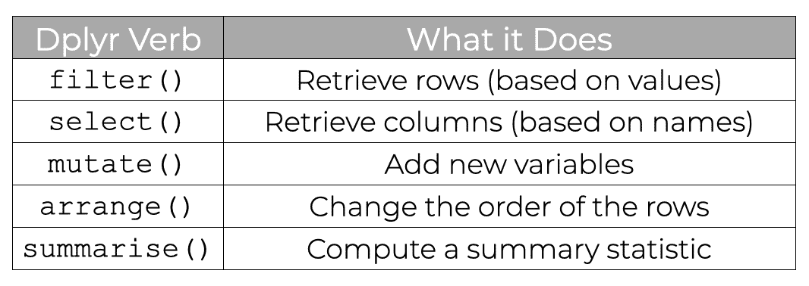
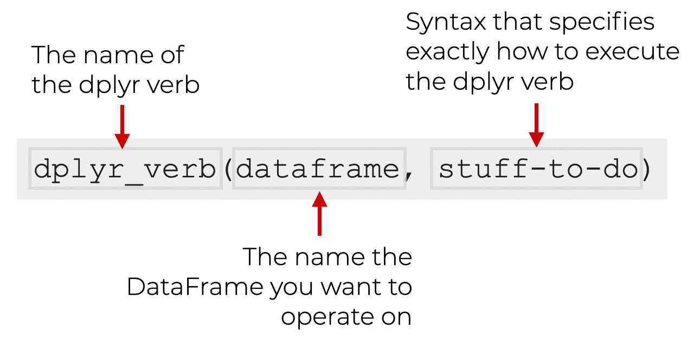
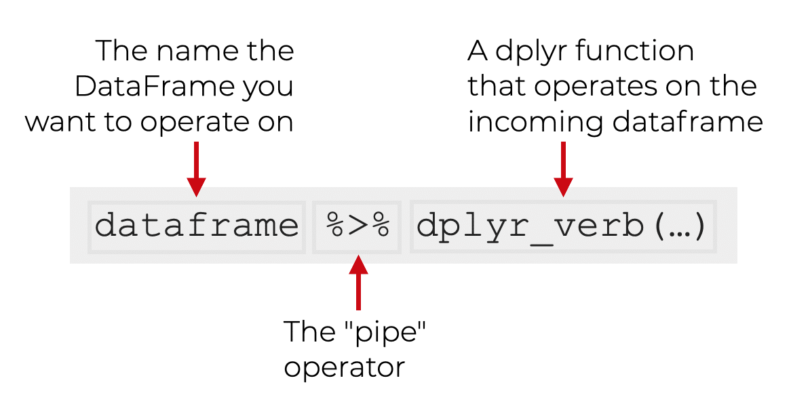

```{r xaringan-themer, include=FALSE, warning=FALSE}
library(xaringanthemer)

style_duo_accent(
    primary_color = "#FF8200",
    secondary_color = "#58595B",
    title_slide_text_color = "#222943",
    title_slide_background_color = "#ededed",
    title_slide_background_image = "https://brand.utk.edu/wp-content/uploads/2019/02/University-HorizRightLogo-RGB.png",
    title_slide_background_position = "bottom",
    title_slide_background_size = "30%"
)
```


```{r setup, include=FALSE}
knitr::opts_chunk$set(echo = FALSE, message = FALSE, warning = FALSE)
```

```{r, echo=FALSE}
# then load all the relevant packages
pacman::p_load(pacman, knitr, tidyverse, readxl)
```

```{r xaringanExtra-clipboard, echo=FALSE}
# these allow any code snippets to be copied to the clipboard so they 
# can be pasted easily
htmltools::tagList(
    xaringanExtra::use_clipboard(button_text = "<i class=\"fa fa-clipboard\"></i>",
                                 success_text = "<i class=\"fa fa-check\" style=\"color: #90BE6D\"></i>", ),
    rmarkdown::html_dependency_font_awesome()
)
```

```{r xaringan-panelset, echo=FALSE}
xaringanExtra::use_panelset()
```

# Purpose and Agenda

What do you need to be able to work with a range of datasets? This week focuses on core data wrangling skills; it is the week that equips you with a set of skills focused on the dplyr and tidyr packages that are part of the tidyverse. The context is accessing and preparing data on colleges in advance of building a better rating system.

## What we'll do in this presentation

- Discussion
- Reading Recap
- Key Concept: select, rename, filter, arrange
- Key Concept: Ratings and rankings
- Code-along and data
- What's next: Assignment(s) and Readings

---

# Discussion

.panelset[

.panel[.panel-name[Background]

- APIs can be very powerful, affording access to large data sets in a convenient manner
- However, they can occasionally be difficult to use due to:

    - Technical issues
    - Challenges around the size or amount of the data being accessed
    - The degree of documentation, among others

]

.panel[.panel-name[Discussion Questions]

- What went well in the last week?
- What issues, if any, did you encounter in the last week using the Education Data Portal API via the educationdata R package? How did you overcome them---or try to overcome them?
- Did you find anything interesting and how would you extend your analysis?

]

]

---

# Reading Recap

Substantive reading(s):

> Morse, R., and & Brooks, E. (2023). How U.S. News Calculated the 2024 Best Colleges Rankings. https://www.usnews.com/education/best-colleges/articles/how-us-news-calculated-the-rankings

> Wolfe, R. (2023). A different kind of college ranking. *Washington Monthly.* https://washingtonmonthly.com/2023/08/27/a-different-kind-of-college-ranking-2/

> Blinder, A. (2023). With a New Formula, U.S. News  Rankings Boost Some State Universities. *New York Times*. https://www.nytimes.com/2023/09/18/us/us-news-college-ranking.html

Technical reading(s):

> Data Science in Education Using R, Using School-Level Aggregate Data to Illuminate Educational Inequities: https://datascienceineducation.com/c09

---

# Reading Recap

<small>
> These rankings, no matter how much data is taken into account can be misleading if you don't know how the rankings are calculated. The articles emphasize how drastically the rankings can change when emphasizing different values. -- Haylee

> Ultimately, college/university is a place in which students typically want to attend to learn, grow, and achieve their full potential to set themselves up for future success. But, if the universities feel like they must conform to some ranking system then how can they use their resources appropriately to help students learn and grow. -- Jeremy

> ... my experience is that it also creates a situation where the quality of teaching (and student success for that matter) is sacrificed to better hunt for those lucrative grants.  The tenure process already does not give enough weight to quality teaching, so adding another reason to prioritize grant writing over teaching seems counter productive to ranking a “best college.” -- Andy

> when a ranking system mirrors the impact of education on the lives of students instead of just selective admissions or endowment size, it provides a much more useful measure of institutional capacity. ... Changes in U.S. News’ formula show that previous rankings tend to disproportionately reward elite institutions with high per-student spending, small class sizes, and strong alumni donations. These mechanisms correlate more with wealth rather than educational effectiveness, putting private schools that are rich at an advantage. -- Olusegun

</small>

---

# Key Concept: dplyr "verbs"

```{r}
#| out.width: 60%
#| fig-align: center

```

---

# Key Concept: dplyr "verbs"

```{r}
#| out.width: 60%
#| fig-align: center



```

---

# Key Concept: dplyr "verbs"

```{r}
#| echo: true
library(dplyr)

dat <- tibble(
    ID = c(1, 2, 3, 4),
    Name = c("Alice", "Bob", "Charlie", "Stefanie"),
    Age = c(25, 30, 22, 39),
    State = c("TN", "NC", "CA", "TN")
)

dat
```

---

# Key Concept: dplyr "verbs"

.panelset[

.panel[.panel-name[dplyr "verbs"]

- There are several functions loaded in the dplyr package (which itself is loaded in the tidyverse package) that are useful in practically all analyses
- These are all "verbs": words used to describe an action, state, or occurrence ([OxfordLanguage](https://languages.oup.com/google-dictionary-en/))
- The core dplyr "verbs" are `select()`, `rename()`, `filter()`, `arrange()`, and `mutate()`
]

.panel[.panel-name[select]

- `select()` is used to choose particular columns from a data frame (or tibble)
- It works by specifying the variables you want to keep or remove

```{r, echo = TRUE}
# Format: select(dataframe, column1, column2, ...) OR dataframe %>% select(column1, column2, ...)
selected_data <- dat %>%
    select(Name, Age)
selected_data
```

- *Important note and point of emphasis*: if we don't assign the output a new name (`selected_data <-`), the results of our use of a dplyr "verb" won't be saved.

]

.panel[.panel-name[rename]

- `rename()` changes the names of variables

```{r, echo = TRUE}
# Format: rename(dataframe, new_column_name = old_column_name)
selected_renamed_data <- 
    selected_data %>%
    rename(name = Name, age = Age)

selected_renamed_data
```

]

.panel[.panel-name[rename]

- *Note*: You can _select_ and _rename_ in a single step using `select()`:

```{r, echo = TRUE}
selected_and_renamed <- 
    dat %>%
    select(name = Name, age = Age) # selects Name and Age and renames them at the same time
```

Because `select()` can be used to rename, `rename()` is rarely used in practice.

Learn more about `select()` and `rename()` [here](https://dplyr.tidyverse.org/reference/select.html) (https://dplyr.tidyverse.org/reference/select.html), including handy "select helpers"

]

.panel[.panel-name[filter]

- `filter()` keeps or removes the rows of your data based on _logical conditions_ that you specify

```{r, echo = TRUE}
# Format: filter(dataframe, condition)
filtered_data <- dat %>%
    filter(Age >= 25)

filtered_data
```

]

.panel[.panel-name[filter]

```{r, echo = TRUE}
filtered_data <- dat %>% 
    filter(State == "TN")

filtered_data
```

Learn more about `filter()` [here](https://dplyr.tidyverse.org/reference/filter.html) (https://dplyr.tidyverse.org/reference/filter.html).

]
]

---

# Key Concept: dplyr "verbs"

.panelset[

.panel[.panel-name[arrange]

- `arrange()` sorts the rows of your data frame based on numeric or alpha-numeric values

```{r, echo = TRUE}
# Format: dataframe %>% arrange(column1, column2, ...)
arranged_data <- dat %>% 
    arrange(Name)

arranged_data
```

]

.panel[.panel-name[arrange]

You can reverse the order with `desc()`:

```{r, echo = TRUE}
arranged_data <- dat %>% 
    arrange(desc(Name))

arranged_data
```

Learn more about `arrange()` [here](https://dplyr.tidyverse.org/reference/arrange.html) (https://dplyr.tidyverse.org/reference/arrange.html).

]

.panel[.panel-name[mutate]

- `mutate()` creates new variables

```{r, echo = TRUE}
# Format: dataframe %>% mutate(new_column, transformation, ...)
mutated_data <- dat %>%
    mutate(age_next_year = Age + 1)

mutated_data
```

Learn more about `mutate()` [here](https://dplyr.tidyverse.org/reference/mutate.html) (https://dplyr.tidyverse.org/reference/mutate.html).

]

]

---

# Key Concept: Ratings and rankings

.panelset[

.panel[.panel-name[educationdata]

- Reminder: The [educationdata R package](https://urbaninstitute.github.io/education-data-package-r/index.html) facilitates access to the [Education Data Portal's API](https://educationdata.urban.org/documentation/index.html)

```{r, eval = FALSE, echo = TRUE}
df <- get_education_data(
    level = "schools",
    source = "ccd",
    topic = "enrollment",
    filters = list(year = 2021, grade = 12))
```

*Documentation:*

1. The [R package documentation](https://urbaninstitute.github.io/education-data-package-r/articles/introducing-educationdata.html) (https://urbaninstitute.github.io/education-data-package-r/articles/introducing-educationdata.html)
2. The [EDP API documentation](https://educationdata.urban.org/documentation/index.html) (https://educationdata.urban.org/documentation/index.html)
] 

.panel[.panel-name[Variables]

- Any data on *colleges*: https://educationdata.urban.org/documentation/colleges.html
- These four sources available via educationdata are likely to be particularly helpful:
    - IPEDS
    - College Scorecard
    - Federal Student Aid
    - National Association of College and University Business Officers

]

.panel[.panel-name[Ranking]

- We will create a ranking involves 1) _accessing data_, 2) _preparing_ different variables, 3) _combining_ them into a single score or rank and 4) _interpreting_ the output
- This will likely involve several dplyr functions:
    - `mutate()`
    - `filter()`
    - `select()`
    - `arrange()`

]

]

---

# Code-along

.panelset[

.panel[.panel-name[Accessing]

- We'll have to access data on each, standardize them, and combine them to create a ranking
- We'll start with student-faculty ratio and fall retention rates
- Let's access the data

```{r, eval = FALSE, echo = TRUE}
library(educationdata)
library(tidyverse)

ratio <- get_education_data(level = "college-university",
    source = "ipeds",
    topic = "student-faculty-ratio",
    filters = list(year = 2020))

retention <- get_education_data(level = "college-university",
    source = "ipeds",
    topic = "fall-retention",
    filters = list(year = 2020))
```

]

.panel[.panel-name[Preparing]

```{r, eval = FALSE, echo = TRUE}
ratio <- as_tibble(ratio)

ratio <- ratio %>% 
    select(unitid, student_faculty_ratio) # to simply the data
```

```{r, eval = FALSE, echo = TRUE}
retention <- as_tibble(retention)

# let's look at the total of both full and part-time students
retention <- retention %>% 
  filter(ftpt == 99) %>% # ftpt: Full-time or part-time status, 99-total
  select(unitid, retention_rate) # to simply the data
```

]

.panel[.panel-name[Combining]

- As the variables are on different scales, calculating _ranks_ may be helpful -- `min_rank()`, which assigns tied ranks to equivalent values

```{r}
x <- c(3.5, 4.0, 3.2, 4.0, 3.8)
min_rank(x)
```

```{r, eval = FALSE, echo = TRUE}
combined_data <- inner_join(ratio, retention, by = c("unitid"))

combined_data <- combined_data %>% 
    mutate(student_faculty_ratio_rank = min_rank(student_faculty_ratio),
           retention_rate_rank = min_rank(retention_rate)) %>% 
    select(unitid, student_faculty_ratio_rank, retention_rate_rank)

final_ranks <- combined_data %>% 
    mutate(total_rank = (student_faculty_ratio_rank + retention_rate_rank) / 2) %>% 
    arrange(total_rank) # sort the data by total rank (average rank)

final_ranks
```

]

.panel[.panel-name[Interpreting]

- We need to know the names of the institutions to be able to present and interpret our results.
- We can access that data, too

```{r, eval = FALSE, echo = TRUE}
directory <- get_education_data(level = "college-university",
    source = "ipeds",
    topic = "directory",
    filters = list(year = 2020))

directory <- directory %>% 
    select(unitid, inst_name)

final_ranks_inst <- final_ranks %>% 
  left_join(directory) %>% 
  select(inst_name, total_rank)
```

]

]

---

# What's next?

.panelset[

.panel[.panel-name[Weekly Assignment]

- In the weekly assignment, you will expand on what we did in the code-along in several ways:
    - Researching how _other ranking systems_ work
    - Planning out your approach in terms of _three principles you want to adhere to_ in your analysis
    - Adding at least _three variables to use in your analysis_
    - Suggesting possible improvements in the context of your interpretation of your results
- Big picture, this is challenging: **the goal is to use this as an opportunity to practice all of the skills you have developed through this point in an authentic task**, but it will be challenging, and try to not let the good become the enemy of the perfect 
]

.panel[.panel-name[Data]

- We'll again be using data from the educationdata package --- any of the college-related data: https://educationdata.urban.org/documentation/colleges.html#ipeds_directory
- Again, these four sources available via educationdata are likely to be particularly helpful:
    - IPEDS
    - College Scorecard
    - Federal Student Aid
    - National Association of College and University Business Officers

]

.panel[.panel-name[Substantive Reading(s)]

- Substantive reading(s) for the week ahead:

> Fisher et al. (2020). Mining big data in education: Affordances and challenges

Linked in Canvas.

]

.panel[.panel-name[Technical Reading(s)]

- Technical reading(s) for the week ahead:

> Summarizing Data by Groups (https://r-graphics.org/recipe-dataprep-summarize)

> Data Transformation (https://r4ds.hadley.nz/data-transform)

Also linked in Canvas.

]

]
