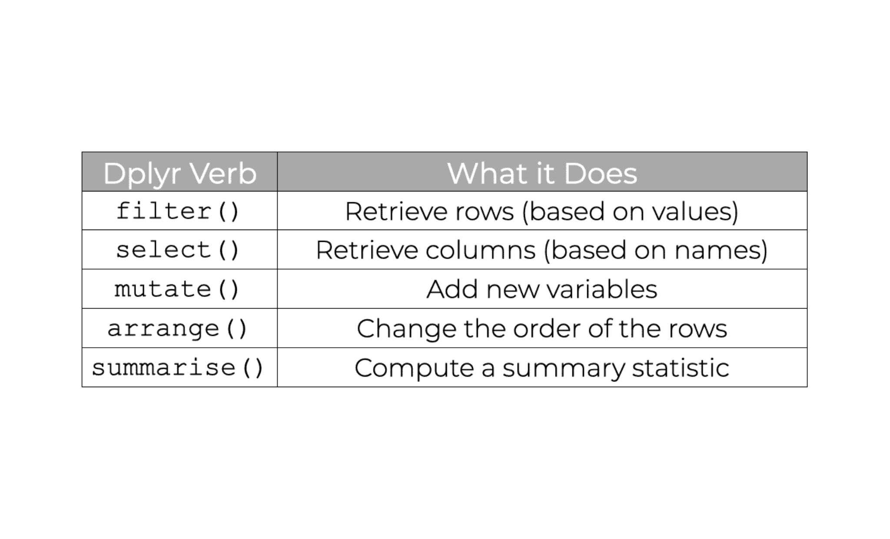
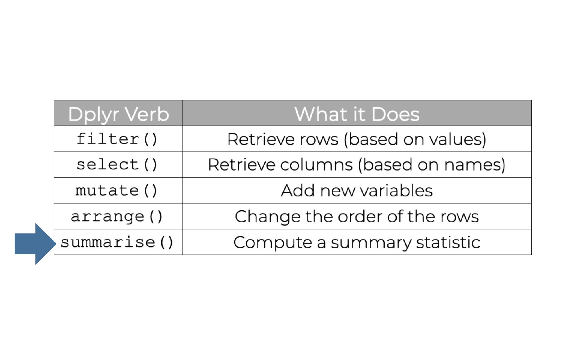
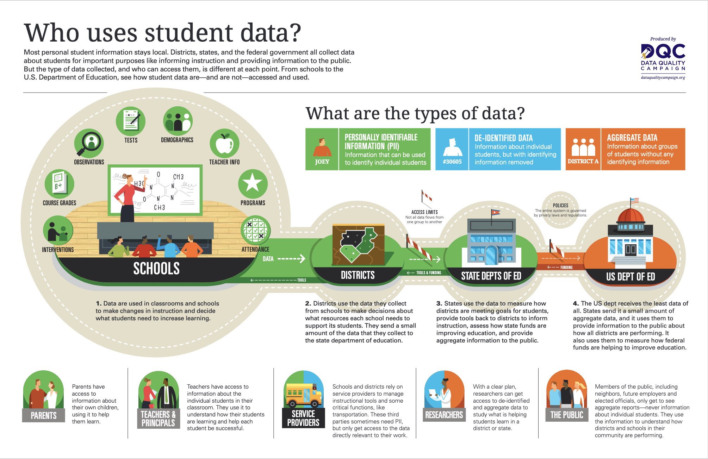
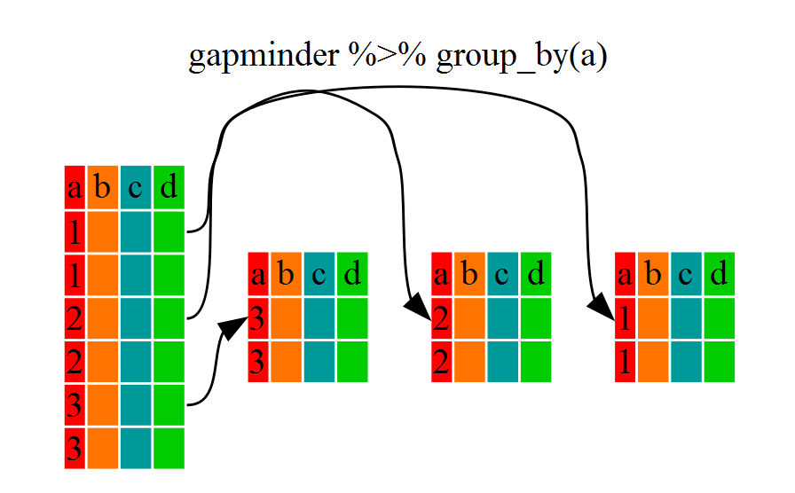
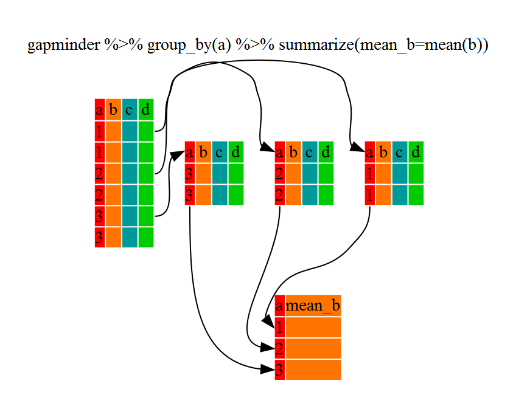

```{r xaringan-themer, include=FALSE, warning=FALSE}
library(xaringanthemer)

style_duo_accent(
    primary_color = "#FF8200",
    secondary_color = "#58595B",
    title_slide_text_color = "#222943",
    title_slide_background_color = "#ededed",
    title_slide_background_image = "https://brand.utk.edu/wp-content/uploads/2019/02/University-HorizRightLogo-RGB.png",
    title_slide_background_position = "bottom",
    title_slide_background_size = "30%"
)
```


```{r setup, include=FALSE}
knitr::opts_chunk$set(echo = FALSE, message = FALSE, warning = FALSE)
library(tidyverse)
library(palmerpenguins)
```

```{r, echo=FALSE}
# then load all the relevant packages
pacman::p_load(pacman, knitr, tidyverse, readxl)
```

```{r xaringanExtra-clipboard, echo=FALSE}
# these allow any code snippets to be copied to the clipboard so they 
# can be pasted easily
htmltools::tagList(
    xaringanExtra::use_clipboard(button_text = "<i class=\"fa fa-clipboard\"></i>",
                                 success_text = "<i class=\"fa fa-check\" style=\"color: #90BE6D\"></i>",),
    rmarkdown::html_dependency_font_awesome()
)
```

```{r xaringan-panelset, echo=FALSE}
xaringanExtra::use_panelset()
```

# Purpose and Agenda

What do you need to be able to work with a range of datasets? This week focuses on core data wrangling skills; it is the week that equips you with a set of skills focused on the dplyr and tidyr packages that are part of the tidyverse. The context is accessing and preparing data on colleges in advance of building a better rating system.

## What we'll do in this presentation

- Mid-semester survey
- Lesson Recap
- Reading Recap
- Discussion
- Key Concept: Group by and summarize
- Code-along and data
- What's next: Assignment(s) and Readings

---

# Mid-semester survey

Please complete it now: https://forms.gle/XNmVyWZL7TikSENaA 

* Contact Hanall (instructor): Course-related or general questions.
* Contact Cody (TA): Troubleshooting questions or anything related to assignments.

---

# Lesson Recap

* Importing data, projects, data frames and tibbles, R markdown
* Functions: glimpse(), view(), skim(), pull(), etc. 
* ggplot2: geom_point(), geom_smooth(), point colors, themes, labels
* Joins: inner_join(), left_join(), right_join(), full_join()
* APIs: web-based APIs, educationdata R package
* dplyr "verbs"

---

# Lesson Recap

```{r}
#| out.width: 60%
#| fig-align: center

```

---

# Today!

```{r}
#| out.width: 60%
#| fig-align: center

```

---

# Reading Recap

Substantive reading(s):

> Fischer, C., Pardos, Z. A., Baker, R. S., Williams, J. J., Smyth, P., Yu, R., ... & Warschauer, M. (2020). Mining big data in education: Affordances and challenges. *Review of Research in Education, 44*(1), 130-160.

Technical reading(s):

> Summarizing Data by Groups: https://r-graphics.org/recipe-dataprep-summarizeLinks

> Data Transformation: https://r4ds.hadley.nz/data-transform (note: only review section 4.5)

---

# Reading Recap


> Ignoring the interdependent relationships within educational data can produce misleading results and ill-informed decision-making. In educational data, the micro level focuses on individual student behavior, which is affected by classroom dynamics and teaching practices that occur on the meso-level. Both levels are influenced by the macro level, which focuses on institutional records and policies. -- Sephora

> Aggregation makes it easier to compare groups, track progress, and make informed decisions at the right scale. -- Qi

> Aggregating data this way is useful because it can help connect small details to the larger picture. The goal is not just to see numbers and what is happening, but how those numbers can help educators understand why things happen. -- Stephen

---

# Aggregated data

.panelset[

.panel[.panel-name[Background]

- One way we can think about _large and complex_ data sets is whether the data is aggregated---or not
- In education data, it is highly common to aggregate raw data (e.g., individual student assessments) at multiple levels:

    - Multiple assessments at the **student level**
    - Multiple students at the **teacher level**
    - Multiple teachers at the **subject level** and **school level**
    - Multiple schools at the **district level**
    - Multiple districts at the **state level**

- What counts as raw and aggregated data differs for each field---and even for each research question!

]

.panel[.panel-name[Background]

```{r}
#| out.width: 80%
#| fig-align: center

```
Source: Data Quality Campaign

]

.panel[.panel-name[Definitions]

- *Raw data* is data that has not been processed for use
- *Row-level/individual data* is data that can be associated with a single element
- *Aggregated data* is when multiple data sources are combined into one set to create a larger idea of a particular issue
- *Disaggregated data* refers to the isolation of one or more variables within a data set, highlighting specific features or populations and leading to different insights 

]

]

---

# Key Concept: Aggregating

.panelset[

.panel[.panel-name[dplyr "verbs"]

- As we discussed in our last class (for week 7), there are several functions loaded in the dplyr package (which itself is loaded in the tidyverse package) that are useful in practically all analyses: `select()`, `rename()`, `filter()`, `arrange()`, and `mutate()`
- Several additional "verbs" are also very useful and are the focus of this and the next week: `group_by()`, `summarize()`, `pivot_longer()`, and `pivot_wider()`
- We focus on the first two of these additional "verbs" this week
- We use the term "aggregating" to refer to grouping and summarizing - specifying groups in our data and summarizing them
]

.panel[.panel-name[group_by]

- `group_by()` is used to specify the group or groups in a a data frame (or tibble)
- It works by specifying the variables you want to keep or remove

```{r}
#| out.width: 60%
#| fig-align: center

```

]

.panel[.panel-name[group_by]

- Let's use our trusty `mtcars` dataset

```{r, echo = TRUE}
mtcars %>%
    group_by(cyl) %>%
    head()
```

]

.panel[.panel-name[multiple groups]

- Importantly, we can specify multiple groups; typically, these variables are character strings or factors but they can be any unique identifiers

```{r, echo = TRUE, eval = FALSE}
mtcars %>%
    group_by(cyl, vs) %>%  # the data is now "grouped" by cyl *and* vs
    head()
```

- What this grouping means is that **summary statistics will be calculated for each unique combination of groups** (specific cyl within specific vs)
- If you apply group_by() to an already grouped dataset, will overwrite the existing grouping variables.

]

.panel[.panel-name[ungrouping]

- To remove all grouping variables, use `ungroup()`:
```{r, echo = TRUE}
mtcars %>%
    group_by(cyl, vs) %>%
    head() %>% 
    ungroup()
```
Learn more about `group_by()` here: https://dplyr.tidyverse.org/reference/group_by.html

]
]

---

# Key Concept: Aggregating

.panelset[

.panel[.panel-name[summarize]

- Once we have specified groups, we can then calculate summary statistics
- `summarise()/summarize()` computes a summary for each group.

- The first part of the `summarize()` function is simply the name of our summary statistic --- whatever we want it to be!
- The second part, following the `=` symbol, is the formula for how your summary statistic is calculated (as long as it returns a single value per group, it is a valid summary statistic!)

```{r, echo = TRUE, eval = TRUE}
mtcars %>% 
    summarize(mean_mpg = mean(mpg)) 
```

]

.panel[.panel-name[summarize]

```{r}
#| out.width: 60%
#| fig-align: center

```

Learn more about summarize here: https://dplyr.tidyverse.org/reference/summarise.html

]

.panel[.panel-name[piping it!]

- We can use the pipe operator to link together these functions in a single block of code
- We can also change our summary statistic or add multiple summary statistics, as below
- Summary statistics are calculated for numeric variables

```{r, echo = TRUE, eval = TRUE}
mtcars %>% 
    group_by(cyl) %>% 
    summarize(n = n(),
              mean_mpg = mean(mpg)) 
```

]
]

---

# Code-along

.panelset[

.panel[.panel-name[grouping]

```{r, eval = FALSE, echo = TRUE}
library(palmerpenguins)
library(tidyverse)

grouped_data <- penguins %>%
    group_by(species)

grouped_data 
# the data is now "grouped" by species (internally)
```

]

.panel[.panel-name[Multiple groups]

```{r, eval = FALSE, echo = TRUE}
grouped_data_2 <- penguins %>%
    group_by(species, island)

grouped_data_2 
# the data is "grouped" by species and island (Again, internally)
```

]

.panel[.panel-name[summarize]

```{r, eval = FALSE, echo = TRUE}
grouped_data %>% 
    summarize(mean_body_mass_g = mean(body_mass_g))

# note: often, we need to add na.rm = TRUE 
# to remove rows with missing values
# can you replace mean with a different measure of central tendency? 
# what do you find?

grouped_data_2 %>% 
    summarize(mean_body_mass_g = mean(body_mass_g)) 
# what is different in this output?

grouped_data_2 %>% 
    summarize(mean_body_mass_g = mean(body_mass_g),
              max_body_mass_g = max(body_mass_g),
              n = n()) 
# n() is a summary function that returns the number of rows per group

```

]

.panel[.panel-name[Doing more]

- There are some helpful extensions of summarize that may prove useful
- Imagine you want to find the mean for _all_ of the numeric variables in your data, after you have grouped by species and island
- Let's start from the raw data, building this up step-by-step, and assigning the output a new name

```{r, eval = FALSE, echo = TRUE}
mean_vals_for_penguins <- penguins %>% 
    group_by(species, island) %>% 
    summarize_if(is.numeric, mean, na.rm = TRUE) 
                    # what if we don't add na.rm = TRUE? try this out!

mean_vals_for_penguins
```
]

.panel[.panel-name[And more!]

- What if we wanted to remove year? We can use select to remove it --- or, try out `summarize_at()`:

```{r, eval = FALSE, echo = TRUE}
mean_vals_for_penguins <- penguins %>% 
    group_by(species, island) %>% 
    summarize_at(vars(bill_length_mm, bill_depth_mm, flipper_length_mm, 
                      body_mass_g), mean, na.rm = TRUE)


mean_vals_for_penguins
```

]

]

---

# What's next?

.panelset[

.panel[.panel-name[Weekly Assignment]

- In the weekly assignment, you will group and summarize school-level data on enrollments, practicing aggregating in three ways:

1. at different levels (groups)
2. for different variables
3. with different summary statistics

]


.panel[.panel-name[Data]

- We'll be using an already-saved version of data we accessed via the educationdata package on school-level enrollments
- The data will be fairly large and complex --- thus suggesting the importance of grouping and summarizing as exploratory data analysis steps

]

.panel[.panel-name[Reading(s)]

- Substantive reading(s) for the week ahead -- Optional:

> Kimmons, R., & Veletsianos, G. (2018). Public internet data mining methods in instructional design, educational technology, and online learning research. TechTrends, 62(5), 492-500.

- Technical reading(s) for the week ahead -- Required:

> Data tidying

Links are in Canvas

]

.panel[.panel-name[Mini-Project (Due Oct 26)]

- The mini-project is now available in Canvas (https://utk.instructure.com/courses/239366/assignments/2443732?module_item_id=5687355)! You will be using recent data from the Tennessee Department of Education. While the data is specified, the analyses you conduct to answer two questions of the data are more open-ended in nature. You'll have __two weeks (Due 11:59 pm on Sunday 10/26/2025)__ to complete this, to allow for time for you to ask questions and dig deep into the data. One pointer - note that many of the variables are at the school-level and represent the percentage of teachers who chose a particular response. How you choose to "wrangle" or prepare the data given the nature of these variables is an important consideration as you work on your mini project. Our goal with this assignment is not perfection, but rather for you to practice capabilities you have developed over the semester. This is reflected in the grading rubric for the assignment!

]

.panel[.panel-name[Asynch class from Oct 20]

- As mentioned in our first session, the class is transitioning to **asynchronous** mode due to my maternity leave, which means we will no longer have live Zoom lectures.
- Instead, I’ll upload the lecture video each week at our regular class time (Monday at 6 pm ET), and you can watch it whenever it’s convenient for you.
- Weekly assignment deadlines remain the same: Sundays at 11:59 p.m.
- For other assignments (mini project, final project plan, and final project), I’ll send reminders via Canvas announcements. 
- Cody and I are here for you! If you need any support, don’t hesitate to reach out to us by email.


]

]
