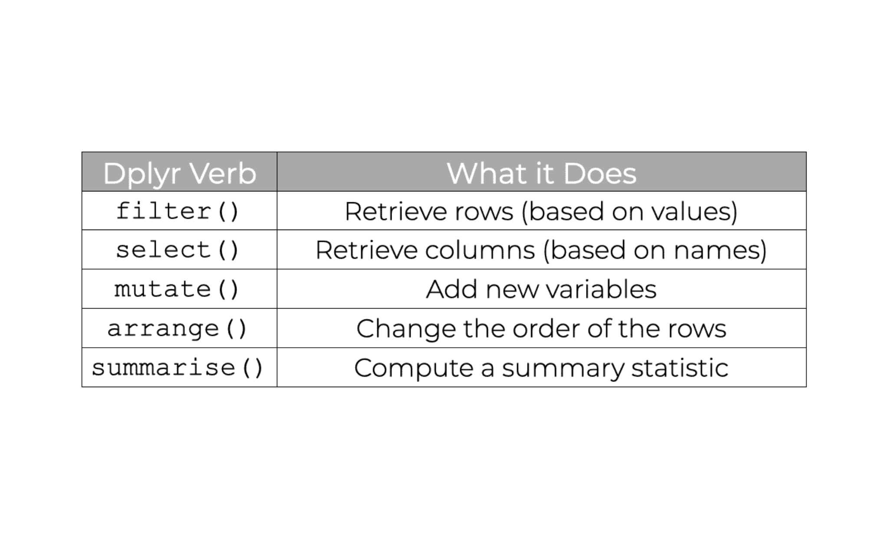
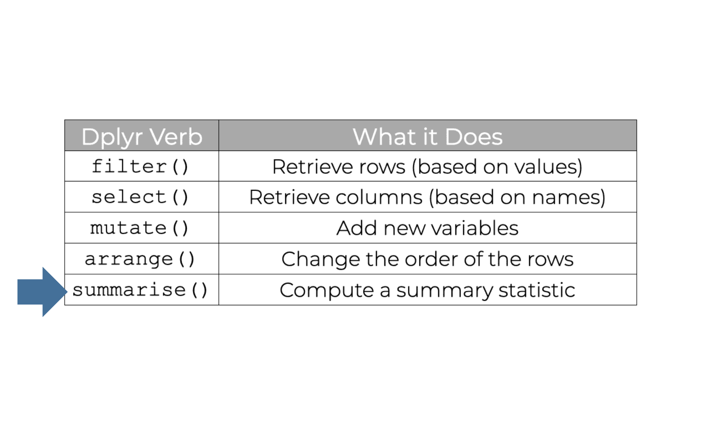
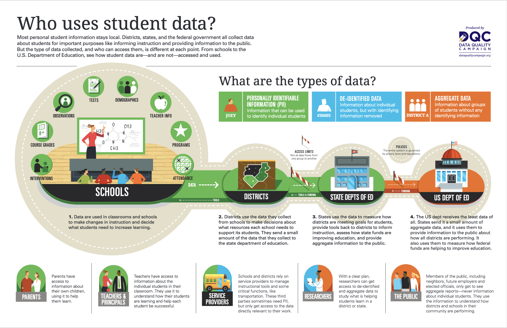

```{r xaringan-themer, include=FALSE, warning=FALSE}
library(xaringanthemer)

style_duo_accent(
    primary_color = "#FF8200",
    secondary_color = "#58595B",
    title_slide_text_color = "#222943",
    title_slide_background_color = "#ededed",
    title_slide_background_image = "https://brand.utk.edu/wp-content/uploads/2019/02/University-HorizRightLogo-RGB.png",
    title_slide_background_position = "bottom",
    title_slide_background_size = "30%"
)
```


```{r setup, include=FALSE}
knitr::opts_chunk$set(echo = FALSE, message = FALSE, warning = FALSE)
library(tidyverse)
library(palmerpenguins)
```

```{r, echo=FALSE}
# then load all the relevant packages
pacman::p_load(pacman, knitr, tidyverse, readxl)
```

```{r xaringanExtra-clipboard, echo=FALSE}
# these allow any code snippets to be copied to the clipboard so they 
# can be pasted easily
htmltools::tagList(
    xaringanExtra::use_clipboard(button_text = "<i class=\"fa fa-clipboard\"></i>",
                                 success_text = "<i class=\"fa fa-check\" style=\"color: #90BE6D\"></i>",),
    rmarkdown::html_dependency_font_awesome()
)
```

```{r xaringan-panelset, echo=FALSE}
xaringanExtra::use_panelset()
```

# Purpose and Agenda

What do you need to be able to work with a range of datasets? This week focuses on core data wrangling skills; it is the first of four weeks that equip you with a set of skills focused on the dplyr and tidyr packages that are part of the tidyverse. The context is accessing and preparing data on colleges in advance of building a better rating system.

## What we'll do in this presentation

- Reading Recap
- Discussion
- Key Concept: Group by and summarize
- Code-along and data
- What's next: Assignment(s) and Readings

---

# Mid-semester survey

## https://forms.gle/3L9yiA69GbENbWgk8

* Discussion posts / substantive readings
* Assignment due date
* Data analysis vs data cleaning
* Assignments in advance
* Functions and iteration
* Code along speed
* Foundation R & Advanced Skills

Contacting us: ivelasq@gmail.com; mweath13@vols.utk.edu

---

# Lesson Recap

* Importing data
* Projects
* Data frames and tibbles
* ggplot2
* Joins
* APIs

---

# Lesson Recap

```{r}
#| out.width: 60%
#| fig-align: center

```

---

# Today!

```{r}
#| out.width: 60%
#| fig-align: center

```

---

# Reading Recap

Substantive reading(s):

> Morse, R., and & Brooks, E. (2023). How U.S. News Calculated the 2024 Best Colleges Rankings. https://www.usnews.com/education/best-colleges/articles/how-us-news-calculated-the-rankings

> Wolfe, R. (2023). A different kind of college ranking. *Washington Monthly.* https://washingtonmonthly.com/2023/08/27/a-different-kind-of-college-ranking-2/

> Blinder, A. (2023). With a New Formula, U.S. News  Rankings Boost Some State Universities. *New York Times*. https://www.nytimes.com/2023/09/18/us/us-news-college-ranking.html

Technical reading(s):

> Esposito, E., & Stark, D. (2019). What's Observed in a Rating? Rankings as Orientation in the Face of Uncertainty. *Theory, Culture & Society, 36*(4), 3-26.

---

# Reading Recap

*Miranda*:

> Ranking systems have biases, particularly towards wealth and privilege.

*Wei*:

> The choice of how much importance each metric receives in the calculation is a subjective decision that can lead to varying results. 

*Tara*:

> Changing the formula for what school is 'best' will directly negatively affect the reputation of schools that prioritize profit and alumni donations, potentially pushing them to begin prioritizing criteria that is often talked about as important but rarely pursued by these institutions.

---

# Reading Recap

What would make a good ranking system?

*Chulin*:

* **Ranking criteria and weights** 
* **Data sources and quality**
* **Transparency and fairness**

*Erika*:

> It would be so amazing if we could just pull up a website, rank how important factors are to us, and generate our own top 10 schools.

---

# Aggregated data

.panelset[

.panel[.panel-name[Background]

- One way we can think about _large and complex_ data sets is whether the data is aggregated---or not
- In education data, it is highly common to aggregate raw data (e.g., individual student assessments) at multiple levels:

- Multiple assessments at the **student level**
- Multiple students at the **teacher level**
- Multiple teachers at the **subject level** and **school level**
- Multiple schools at the **district level**
- Multiple districts at the **state level**

- What counts as raw and aggregated data differs for each field---and even for each research question!

]

.panel[.panel-name[Background]

```{r}
#| out.width: 60%
#| fig-align: center

```

Source: Data Quality Campaign

]

.panel[.panel-name[Definitions]

- *Raw data* is data that has not been processed for use
- *Row-level/individual data* is data that can be associated with a single element
- *Aggregated data* is when multiple data sources are combined into one set to create a larger idea of a particular issue
- *Disaggregated data* refers to the isolation of one or more variables within a data set, highlighting specific features or populations and leading to different insights 

]

.panel[.panel-name[Discussion Questions]

- For your research-related area of interest, what are one or more levels at which row-level data is aggregated?
- For which purposes might **raw data** be more useful? For which purposes might aggregated data be useful?

]

]

---

# Key Concept: Aggregating

.panelset[

.panel[.panel-name[dplyr "verbs"]

- As we discussed in our last class (for weeks 7-8), there are several functions loaded in the dplyr package (which itself is loaded in the tidyverse package) that are useful in practically all analyses: `select()`, `rename()`, `filter()`, `arrange()`, and `mutate()`
- Several additional "verbs" are also very useful and are the focus of this and the next week: `group_by()`, `summarize()`, `pivot_longer()`, and `pivot_wider()`
- We focus on the first two of these additional "verbs" this week
- We use the term "aggregating" to refer to grouping and summarizing - specifying groups in our data and summarizing them
]

.panel[.panel-name[group_by]

- `group_by()` is used to specify the group or groups in a a data frame (or tibble)
- It works by specifying the variables you want to keep or remove

```{r}
#| out.width: 60%
#| fig-align: center
knitr::include_graphics("group_by.png")
```

]

.panel[.panel-name[group_by]

- Let's use our trusty `mtcars` dataset

```{r, echo = TRUE}
mtcars %>%
    group_by(cyl) %>%
    head()
```

]

.panel[.panel-name[multiple groups]

- Importantly, we can specify multiple groups; typically, groups are a character string or factor, but they can be any unique identifiers

```{r, echo = TRUE, eval = FALSE}
mtcars %>%
    group_by(cyl, vs) %>%  # the data is now "grouped" by cyl *and* vs
    head()
```

- What this grouping means is that **summary statistics will be calculated for each unique combination of groups** (specific cyl within specific vs)
- If you apply group_by() to an already grouped dataset, will overwrite the existing grouping variables.

]

.panel[.panel-name[ungrouping]

- To remove all grouping variables, use `ungroup()`:

```{r, echo = TRUE}
mtcars %>%
    group_by(cyl, vs) %>%
    head() %>% 
    ungroup()
```

Learn more about `group_by()` [here](https://dplyr.tidyverse.org/reference/group_by.html)

]
]

---

# Key Concept: Aggregating

.panelset[

.panel[.panel-name[summarize]

- Once we have specified groups, we can then calculate summary statistics
- `summarise()/summarize()` computes a summary for each group.
- The first part of the `summarize()` function is simply the name of our summary statistic --- whatever we want it to be!
- The second part, following the `=` symbol, is the formula for how your summary statistic is calculated (as long as it returns a single value per group, it is a valid summary statistic!)

]

.panel[.panel-name[summarize]

```{r, echo = TRUE, eval = TRUE}
mtcars %>% 
    summarize(mean_mpg = mean(mpg)) 
```

]

.panel[.panel-name[summarize]

```{r}
#| out.width: 60%
#| fig-align: center
knitr::include_graphics("summarize.png")
```

Learn more about summarize [here](https://dplyr.tidyverse.org/reference/summarize.html)

]

.panel[.panel-name[piping it!]

- We can use the pipe operator to link together these functions in a single block of code
- We can also change our summary statistic or add multiple summary statistics, as below
- Summary statistics are calculated for numeric variables

```{r, echo = TRUE, eval = TRUE}
mtcars %>% 
    group_by(cyl) %>% 
    summarize(n = n(),
              mean_mpg = mean(mpg)) 
```

]
]

---

# Code-along

.panelset[

.panel[.panel-name[grouping]

```{r, eval = FALSE, echo = TRUE}
library(palmerpenguins)
library(tidyverse)

grouped_data <- penguins %>%
    group_by(species)

grouped_data # the data is now "grouped" by species
```

]

.panel[.panel-name[Multiple groups]

```{r, eval = FALSE, echo = TRUE}
grouped_data_2 <- penguins %>%
    group_by(species, island)

grouped_data # the data is now "grouped" by species and island
```

]

.panel[.panel-name[summarize]

```{r, eval = FALSE, echo = TRUE}
grouped_data %>% 
    summarize(mean_body_weight_g = mean(body_weight_g))

# note: often, we need to add na.rm = TRUE to remove rows with missing values
# can you replace mean with a different measure of central tendency? what do you find?

grouped_data_2 %>% 
    summarize(mean_body_weight_g = mean(body_weight_g)) # what is different in this output?

grouped_data_2 %>% 
    summarize(mean_body_weight_g = mean(body_weight_g),
              max_body_weight_g = max(body_weight_g),
              n = n()) # n() is a helpful summary function that returns the number of rows per group

```

]

.panel[.panel-name[Doing more]

- There are some helpful extensions of summarize that may prove useful
- Imagine you want to find the mean for _all_ of the numeric variables in your data, after you have grouped by species and island
- Let's start from the raw data, building this up step-by-step, and assigning the output a new name

```{r, eval = FALSE, echo = TRUE}
mean_vals_for_penguins <- penguins %>% 
    group_by(species, island) %>% 
    summarize_if(is.numeric, mean, na.rm = TRUE) # what if we don't add na.rm = TRUE? try this out!

mean_vals_for_penguins
```
]

.panel[.panel-name[And more!]

- What if we wanted to remove year? We can use select to remove it --- or, try out `summarize_at()`:

```{r}
mean_vals_for_penguins <- penguins %>% 
    group_by(species, island) %>% 
    summarize_at(vars(bill_length_mm, bill_depth_mm, flipper_length_mm, body_mass_g), mean, na.rm = TRUE)


mean_vals_for_penguins
```

]

]

---

# What's next?

.panelset[

.panel[.panel-name[Weekly Assignment]

- In the weekly assignment, you will group and summarize school-level data on enrollments, practicing aggregating in three ways:

1. at different levels (groups)
2. for different variables
3. with different summary statistics

]


.panel[.panel-name[Data]

- We'll be using an already-saved version of data we accessed via the educationdata package on school-level enrollments
- The data will be fairly large and complex --- thus suggesting the importance of grouping and summarizing as exploratory data analysis steps

]


.panel[.panel-name[Final Project Planning]

- There is an additional assignment this week: Final Project Planning
- In this assignment, you will read a bit about the final project, and share some _initial, preliminary ideas_ (not final plans!) to receive early feedback (and to get your gears turning regarding what you will do)
- Since this is also due in the next week, the assignment and reading discussion are a slightly more brief than that those you have recently completed; be sure to budget time to start to think about your final project

]


.panel[.panel-name[Substantive Reading(s)]

- Substantive reading(s) for the week ahead:

> Fischer, C., Pardos, Z. A., Baker, R. S., Williams, J. J., Smyth, P., Yu, R., ... & Warschauer, M. (2020). Mining big data in education: Affordances and challenges. *Review of Research in Education, 44*(1), 130-160.

*In this reading, focus on the complexity of data used in education (or your field) and how and why data mining can involve data at different levels or groups**

]

.panel[.panel-name[Technical Reading(s)]

- Technical reading(s) for the week ahead:

> Summarizing Data by Groups: https://r-graphics.org/recipe-dataprep-summarize

> Data Transformation: https://r4ds.hadley.nz/data-transform

For the second reading, please review section 4.5 (from this reading that we already completed)

]

]
